# Backend Module Specifications - FlowBoard

**Date:** March 17, 2026  
**Version:** 1.0  
**Status:** Comprehensive Technical Specification

---

## Table of Contents

### Tier 1: Core Domain Services
1. [UserAuthenticationService](#module-1-userauthenticationservice)
2. [ProjectService](#module-2-projectservice)
3. [AIEngine](#module-3-aiengine)
4. [BoardGenerator](#module-4-boardgenerator)
5. [MeetingService](#module-5-meetingservice)
6. [SummaryService](#module-6-summaryservice)
7. [ApprovalService](#module-7-approvalservice)
8. [ChangePreviewService](#module-8-changepreviewservice)
9. [ChangeApplicationService](#module-9-changeapplicationservice)

### Tier 2: Utilities & Adapters
10. [PromptBuilder](#module-10-promptbuilder)
11. [ContentStructurer](#module-11-contentstructurer)
12. [DiffCalculator](#module-12-diffcalculator)
13. [ImpactAnalyzer](#module-13-impactanalyzer)
14. [ConflictResolver](#module-14-conflictresolver)
15. [LLMClient](#module-15-llmclient)
16. [KanbanBoardGateway](#module-16-kanbanboardgateway)
17. [MeetingGateway](#module-17-meetinggateway)

### Tier 3: Data Access & Persistence
18. [Repository Layer](#tier-3-repository-layer)
19. [Database Schemas](#database-schemas)

### Reference & Implementation Guidance
20. [ADT Compliance Guidelines](#adt-compliance-guidelines)
21. [Invariant Specifications](#invariant-specifications)

---

## Module 1: UserAuthenticationService

**Category:** Core Domain Service  
**Used By:** All workflows (WF1, WF2, WF3)  
**Stability Level:** STABLE

### Features

This module provides:
- **User registration** with email/password validation
- **JWT-based authentication** with 24-hour token expiration
- **Password hashing** via bcrypt (cost factor 12)
- **Role-based access control** (ADMIN, MANAGER, MEMBER, VIEWER)
- **Token validation and refresh** for stateless authentication
- **User profile management** (read/update profile)
- **Session invalidation** (logout, token revocation)

This module does NOT provide:
- OAuth/SAML integration (future enhancement)
- Multi-factor authentication (future enhancement)
- Social login (future enhancement)

### Internal Architecture

The UserAuthenticationService is responsible for lifecycle management of user identity and access tokens. It acts as a facade over password hashing, JWT generation, and user repository operations. The service enforces security invariants: passwords are always hashed before storage, tokens include user claims and signature validation, and role assignments are immutable after creation (changed only via explicit update calls with audit). 

The service is stateless and can run in multiple instances without coordination. Authentication state is entirely represented in JWT tokens, which are validated using a shared secret key. Password attempts are tracked at the database level to prevent brute force attacks.

**Architecture Diagram:**

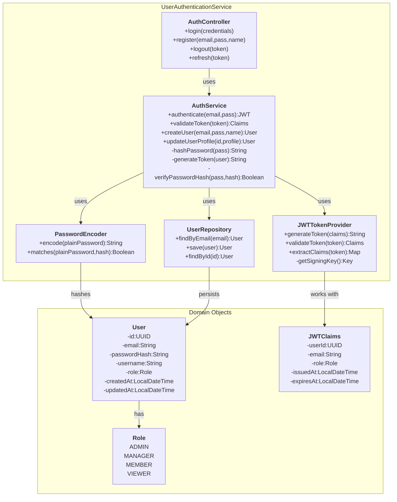
```mermaid
graph TB
    subgraph "UserAuthenticationService"
        A["<b>AuthController</b><br/>+login(credentials)<br/>+register(email,pass,name)<br/>+logout(token)<br/>+refresh(token)"]
        B["<b>AuthService</b><br/>+authenticate(email,pass):JWT<br/>+validateToken(token):Claims<br/>+createUser(email,pass,name):User<br/>+updateUserProfile(id,profile):User<br/>-hashPassword(pass):String<br/>-generateToken(user):String<br/>-verifyPasswordHash(pass,hash):Boolean"]
        C["<b>JWTTokenProvider</b><br/>+generateToken(claims):String<br/>+validateToken(token):Claims<br/>+extractClaims(token):Map<br/>-getSigningKey():Key"]
        D["<b>PasswordEncoder</b><br/>+encode(plainPassword):String<br/>+matches(plainPassword,hash):Boolean"]
        E["<b>UserRepository</b><br/>+findByEmail(email):User<br/>+save(user):User<br/>+findById(id):User"]
    end
    
    subgraph "Domain Objects"
        F["<b>User</b><br/>-id:UUID<br/>-email:String<br/>-passwordHash:String<br/>-username:String<br/>-role:Role<br/>-createdAt:LocalDateTime<br/>-updatedAt:LocalDateTime"]
        G["<b>Role</b><br/>ADMIN<br/>MANAGER<br/>MEMBER<br/>VIEWER"]
        H["<b>JWTClaims</b><br/>-userId:UUID<br/>-email:String<br/>-role:Role<br/>-issuedAt:LocalDateTime<br/>-expiresAt:LocalDateTime"]
    end
    
    A -->|uses| B
    B -->|uses| C
    B -->|uses| D
    B -->|uses| E
    C -->|works with| H
    D -->|hashes| F
    E -->|persists| F
    F -->|has| G
```

### Design Justification

**JWT over Sessions:** We use JWT tokens instead of server-side sessions because:
1. **Horizontal Scalability** - Any server instance can validate a JWT without shared state
2. **Microservices Ready** - If we split services later, each can verify tokens independently
3. **Stateless Architecture** - Reduces dependency on Redis/Memcached for session storage
4. **Standard Export** - JWT is the industry standard for REST API authentication

**Bcrypt over SHA/MD5:** Bcrypt is intentionally slow (cost factor 12 = ~100ms per attempt) to:
1. **Prevent Brute Force** - 10 password guesses per second max, not 1 million/second
2. **GPU Resistant** - Bcrypt's memory requirements make GPU attacks impractical
3. **Future Proof** - Cost factor can be increased as hardware improves

**Role-Based not Attribute-Based:** We use simple RBAC (4 roles) rather than fine-grained permissions because:
1. **Simplicity** - Easier for non-technical managers to understand
2. **Performance** - Single enum comparison vs. complex permission matrix lookups
3. **Auditability** - Changes to roles are easier to track than permission changes
4. **Sufficient Coverage** - The three workflows only need 4 role levels

**Representation Independence via PasswordEncoder Interface:** 
Password hashing is abstracted behind the `PasswordEncoder` interface (not concrete bcrypt dependency). This allows us to:
1. **Swap algorithms** - Can upgrade to Argon2, scrypt, or PBKDF2 without changing AuthService
2. **Test with mocks** - Unit tests can mock PasswordEncoder without real bcrypt overhead
3. **Isolate concerns** - Hashing logic separated from authentication logic

### Data Abstraction (MIT 6.005)

#### Rep Invariant

A valid `User` object in memory satisfies ALL of these constraints:

```
1. id ≠ null (UUID)
2. email ≠ null AND email matches ^[^@]+@[^@]+\.[^@]+$
3. passwordHash ≠ null AND length(passwordHash) ≥ 60 (bcrypt format)
4. username ≠ null AND 3 ≤ length(username) ≤ 50 AND matches [a-zA-Z0-9_]+
5. role ∈ {ADMIN, MANAGER, MEMBER, VIEWER}
6. createdAt ≠ null AND createdAt ≤ LocalDateTime.now()
7. updatedAt ≥ createdAt
8. If isDeletionMarked = true, then deletedAt ≠ null AND deletedAt ≤ LocalDateTime.now()
```

These invariants are enforced in the database via constraints and in Java via constructor validation and checkRep().

#### Abstraction Function

The `User` class abstracts the database representation into an authenticated identity:

```
AF(this) = AuthenticatedUser {
  id := this.id
  email := this.email
  username := this.username
  role := this.role
  createdAt := this.createdAt
  updatedAt := this.updatedAt
}

NOT exposed in AF (internal only):
  - passwordHash (only accessible via .matchesPassword())
  - isDeletionMarked, deletedAt (states handled by service logic)
  - login_attempts history (tracked separately)
```

**Why:** Clients should never see or manipulate password hashes directly. Password verification happens exclusively through `AuthService.authenticate()` and `User.matchesPassword()` methods.

#### Representation Hiding & checkRep()

**Password Hash Hiding:**
```java
public class User {
    private final UUID id;
    private final String email;
    private final String passwordHash;  // NEVER exposed
    private final String username;
    private final Role role;
    
    // ✓ Constructor validates invariants and calls checkRep()
    public User(UUID id, String email, String passwordHash, String username, Role role) {
        this.id = Objects.requireNonNull(id, "id cannot be null");
        this.email = Objects.requireNonNull(email, "email cannot be null");
        validateEmail(email);
        this.passwordHash = Objects.requireNonNull(passwordHash, "passwordHash cannot be null");
        validatePasswordHashFormat(passwordHash);
        this.username = Objects.requireNonNull(username, "username cannot be null");
        validateUsername(username);
        this.role = Objects.requireNonNull(role, "role cannot be null");
        checkRep();  // Runtime verification
    }
    
    // ✓ checkRep() method verifies invariants at runtime
    private void checkRep() {
        assert id != null : "Rep invariant violated: id is null";
        assert email != null && email.matches("^[^@]+@[^@]+\\.[^@]+$") 
            : "Rep invariant violated: invalid email format";
        assert passwordHash != null && passwordHash.length() >= 60 
            : "Rep invariant violated: passwordHash not in bcrypt format";
        assert username != null && username.length() >= 3 && username.length() <= 50 
            : "Rep invariant violated: username length out of bounds";
        assert role != null 
            : "Rep invariant violated: role is null";
    }
    
    // ✓ Public getters return values, not references
    public UUID getId() { return id; }  // UUID immutable
    public String getEmail() { return email; }  // String immutable
    public String getUsername() { return username; }  // String immutable
    public Role getRole() { return role; }  // Enum immutable
    
    // ✗ NO public getter for passwordHash (representation hidden)
    // ✓ Only way to verify password is through this method:
    public boolean matchesPassword(String plainPassword, PasswordEncoder encoder) {
        checkRep();  // Verify invariant before use
        return encoder.matches(plainPassword, this.passwordHash);
    }
}
```

**Defensive Copying for Collections:**
When returning collections from AuthService (e.g., user authorities), use immutable wrappers:
```java
public Collection<SimpleGrantedAuthority> getAuthorities(User user) {
    checkRep();  // Verify invariant
    return Collections.unmodifiableSet(
        Set.of(user.getRole().toAuthority())
    );
    // Reason: Prevents clients from modifying authorities to escalate privileges
}
```

#### Invariant Preservation Contracts

**Creators (establish invariants):**

| Creator | Responsibility | Invariants Established |
|---------|---|---|
| `AuthService.createUser(email, password, username)` | Validate all inputs; hash password; persist | All 8 rep invariant constraints |
| `JWTTokenProvider.generateToken(claims)` | Encode and sign claims | Token expiration set to now + 24hrs; signature valid |

**Mutators (preserve invariants):**

| Mutator | Precondition | Postcondition | Preserved Invariants |
|---------|---|---|---|
| `AuthService.updateUserProfile(userId, newUsername)` | userId exists; newUsername valid | username updated; updatedAt ≥ old updatedAt | id, email, passwordHash, role immutable; email uniqueness |
| `AuthService.updatePassword(userId, currentPassword, newPassword)` | currentPassword matches stored hash; newPassword valid | passwordHash updated to new bcrypt hash | id, email, username, role immutable; invariant 3 maintained |

**Observers (cannot modify state):**
- All `get*()` methods: return immutable values or defensive copies
- `AuthService.validateToken(token)`: reads token without modification
- `User.matchesPassword()`: compares without storing password

#### Representation Exposure Risk Analysis

| Field | Exposure Risk | Mitigation | Status |
|-------|---|---|---|
| `id` | LOW | UUID is immutable value type | ✓ SAFE |
| `email` | LOW | String is immutable; unique constraint enforced | ✓ SAFE |
| `passwordHash` | **CRITICAL** | Never exposed; hidden field; only accessed via checkRep and matchesPassword | ✓ SAFE |
| `username` | LOW | String is immutable | ✓ SAFE |
| `role` | LOW | Enum is immutable; cannot be modified | ✓ SAFE |
| `createdAt`, `updatedAt` | LOW | LocalDateTime is effectively immutable (no setters used) | ✓ SAFE |
| JWT Token in SecurityClaims | MEDIUM | Claims immutable; but token string itself is not validated in constructor | ⚠️ NEEDS IMPROVEMENT: Constructor should call validateTokenFormat() |

**Schema Constraints Enforce Rep:**
```sql
CONSTRAINT valid_email CHECK (email ~ '^[^@]+@[^@]+\.[^@]+$'),
CONSTRAINT valid_role CHECK (role IN ('ADMIN', 'MANAGER', 'MEMBER', 'VIEWER')),
CONSTRAINT valid_username CHECK (length(username) >= 3 AND length(username) <= 50),
UNIQUE(email)                                    -- Ensures email uniqueness
```

### Stable Storage

**Tables:**

```sql
-- users table
CREATE TABLE users (
    id UUID PRIMARY KEY DEFAULT gen_random_uuid(),
    email VARCHAR(255) NOT NULL UNIQUE,
    password_hash VARCHAR(255) NOT NULL,
    username VARCHAR(100) NOT NULL,
    role VARCHAR(50) NOT NULL DEFAULT 'MEMBER',
    created_at TIMESTAMP NOT NULL DEFAULT CURRENT_TIMESTAMP,
    updated_at TIMESTAMP NOT NULL DEFAULT CURRENT_TIMESTAMP,
    CONSTRAINT valid_email CHECK (email ~ '^[^@]+@[^@]+\.[^@]+$'),
    CONSTRAINT valid_role CHECK (role IN ('ADMIN', 'MANAGER', 'MEMBER', 'VIEWER'))
);

CREATE INDEX idx_users_email ON users(email);
CREATE INDEX idx_users_role ON users(role);

-- login_attempts table (for brute force prevention)
CREATE TABLE login_attempts (
    id UUID PRIMARY KEY DEFAULT gen_random_uuid(),
    email VARCHAR(255) NOT NULL,
    success BOOLEAN NOT NULL,
    ip_address VARCHAR(45),
    attempted_at TIMESTAMP NOT NULL DEFAULT CURRENT_TIMESTAMP,
    CONSTRAINT fk_login_attempts_user FOREIGN KEY (email) REFERENCES users(email)
);

CREATE INDEX idx_login_attempts_email_time ON login_attempts(email, attempted_at DESC);
```

**Schema Justification:**
- `role` is VARCHAR enum (not a separate table) for simplicity; 4 options don't require normalization
- `login_attempts` is separate table to avoid storing N login history on every user record
- `email` unique constraint because emails are the authentication principal
- Indices on `email` for auth lookup, on `role` for permission filtering

### REST API Specification

#### POST /api/v1/auth/register

**Request:**
```json
{
  "email": "user@example.com",
  "password": "SecurePassword123!",
  "username": "john_doe"
}
```

**Validation:**
- `email` must match regex: `^[^@]+@[^@]+\.[^@]+$`
- `password` must be 8+ characters, contain uppercase, lowercase, digit, special char
- `username` must be 3-50 characters, alphanumeric + underscore

**Response (201 Created):**
```json
{
  "id": "550e8400-e29b-41d4-a716-446655440000",
  "email": "user@example.com",
  "username": "john_doe",
  "role": "MEMBER",
  "createdAt": "2026-03-17T12:00:00Z"
}
```

**Error Responses:**
- `400 Bad Request` - Validation failed (password too weak, invalid email)
- `409 Conflict` - Email already exists

#### POST /api/v1/auth/login

**Request:**
```json
{
  "email": "user@example.com",
  "password": "SecurePassword123!"
}
```

**Response (200 OK):**
```json
{
  "token": "eyJhbGciOiJIUzI1NiIsInR5cCI6IkpXVCJ9...",
  "expiresIn": 86400,
  "user": {
    "id": "550e8400-e29b-41d4-a716-446655440000",
    "email": "user@example.com",
    "username": "john_doe",
    "role": "ADMIN"
  }
}
```

**Error Responses:**
- `401 Unauthorized` - Invalid credentials
- `429 Too Many Requests` - More than 10 failed attempts in 15 minutes

**Security:**
- Token returned in response body (client stores in httpOnly cookie)
- Token includes userId, email, role, expiration claims
- Token signature verified on every API call via Spring Security filter

#### POST /api/v1/auth/logout

**Request:**
```json
{
  "token": "eyJhbGciOiJIUzI1NiIsInR5cCI6IkpXVCJ9..."
}
```

**Response (204 No Content)**

**Implementation:** Adds token to blacklist (Redis cache), expires in 24 hours

#### POST /api/v1/auth/refresh

**Request:**
```json
{
  "token": "eyJhbGciOiJIUzI1NiIsInR5cCI6IkpXVCJ9..."
}
```

**Response (200 OK):**
```json
{
  "token": "eyJhbGciOiJIUzI1NiIsInR5cCI6IkpXVCJ9...",
  "expiresIn": 86400
}
```

**Error Responses:**
- `401 Unauthorized` - Token expired (TTL > 1 hour ago) or invalid
- `422 Unprocessable Entity` - Token in blacklist

#### GET /api/v1/users/{id}

**Authentication:** Required (JWT in Authorization header)

**Response (200 OK):**
```json
{
  "id": "550e8400-e29b-41d4-a716-446655440000",
  "email": "user@example.com",
  "username": "john_doe",
  "role": "MANAGER",
  "createdAt": "2026-03-17T12:00:00Z",
  "updatedAt": "2026-03-17T14:30:00Z"
}
```

**Error Responses:**
- `404 Not Found` - User does not exist
- `401 Unauthorized` - Not authenticated

#### PUT /api/v1/users/{id}

**Authentication:** Required. User can update own profile. ADMIN can update any profile.

**Request:**
```json
{
  "username": "new_username",
  "password": "NewPassword123!"
}
```

**Response (200 OK):**
```json
{
  "id": "550e8400-e29b-41d4-a716-446655440000",
  "email": "user@example.com",
  "username": "new_username",
  "role": "MANAGER",
  "updatedAt": "2026-03-17T15:00:00Z"
}
```

**Error Responses:**
- `403 Forbidden` - Cannot update another user's profile (MEMBER trying to update MANAGER)
- `400 Bad Request` - Password validation failed

### Class Declarations

```java
package com.flowboard.auth;

// ============ PUBLIC INTERFACE ============

/** 
 * REST endpoint for authentication operations.
 * Handles registration, login, logout, token refresh.
 */
@RestController
@RequestMapping("/api/v1/auth")
public class AuthController {
    public record LoginRequest(String email, String password) { }
    public record RegisterRequest(String email, String password, String username) { }
    public record LoginResponse(String token, long expiresIn, UserDTO user) { }
    
    @PostMapping("/register")
    public ResponseEntity<UserDTO> register(@Valid @RequestBody RegisterRequest request);
    
    @PostMapping("/login")
    public ResponseEntity<LoginResponse> login(@Valid @RequestBody LoginRequest request);
    
    @PostMapping("/logout")
    public ResponseEntity<Void> logout(@RequestHeader("Authorization") String token);
    
    @PostMapping("/refresh")
    public ResponseEntity<LoginResponse> refresh(@RequestHeader("Authorization") String token);
}

/**
 * Service interface for user authentication and profile management.
 * Implements stateless JWT-based authentication.
 */
@Service
public class AuthService {
    // Public methods
    public String authenticate(String email, String password) throws AuthenticationException;
    public User createUser(String email, String password, String username) throws UserAlreadyExistsException;
    public User getUserProfile(UUID userId) throws UserNotFoundException;
    public User updateUserProfile(UUID userId, UserProfileUpdate update) throws UserNotFoundException;
    public SecurityClaims validateToken(String token) throws TokenExpiredException, TokenInvalidException;
    public void logout(String token);
    
    // Private methods
    private boolean verifyPasswordMatch(String plainPassword, String hash);
    private void trackLoginAttempt(String email, boolean success, String ipAddress);
    private void checkBruteForceAttempts(String email) throws TooManyLoginAttemptsException;
    private User findAndValidateUser(String email) throws UserNotFoundException;
}

/**
 * JWT token generation, validation, and claims extraction.
 * Uses HMAC-SHA256 signing with 24-hour expiration.
 */
@Component
public class JWTTokenProvider {
    public String generateToken(SimpleGrantedAuthority role, UUID userId, String email);
    public SecurityClaims validateAndExtractClaims(String token) throws JwtException;
    public boolean isTokenExpired(String token);
    public long getExpirationTime();  // returns 86400 (seconds)
    
    private Key getSigningKey();
    private Claims extractAllClaims(String token);
}

/**
 * Password encoding and verification using bcrypt.
 * Intentionally slow to prevent brute force attacks.
 */
@Component
public class PasswordEncoder {
    public String encode(String plainPassword);
    public boolean matches(String plainPassword, String encodedPassword);
}

/**
 * Domain object representing an authenticated user.
 * Immutable after construction.
 */
public class User {
    private final UUID id;
    private final String email;
    private final String passwordHash;  // NEVER exposed in serialization
    private final String username;
    private final Role role;
    private final LocalDateTime createdAt;
    private final LocalDateTime updatedAt;
    
    public UUID getId();
    public String getEmail();
    public String getUsername();
    public Role getRole();
    public LocalDateTime getCreatedAt();
    public LocalDateTime getUpdatedAt();
    
    public boolean matchesPassword(String plainPassword, PasswordEncoder encoder);
}

/**
 * Role enumeration for RBAC.
 */
public enum Role {
    ADMIN("Can create users, edit projects, approve all changes"),
    MANAGER("Can create projects, requires manager approval"),
    MEMBER("Can view boards, create cards, needs manager approval"),
    VIEWER("Read-only access, cannot modify");
}

/**
 * Immutable data class for JWT claims.
 */
public class SecurityClaims {
    public UUID getUserId();
    public String getEmail();
    public Role getRole();
    public LocalDateTime getIssuedAt();
    public LocalDateTime getExpiresAt();
    public Instant getExpiration();
}

/**
 * Repository interface for user persistence.
 */
@Repository
public interface UserRepository extends JpaRepository<User, UUID> {
    Optional<User> findByEmail(String email);
    Optional<User> findByUsername(String username);
    List<User> findByRole(Role role);
}
```

### Class Hierarchy Diagram

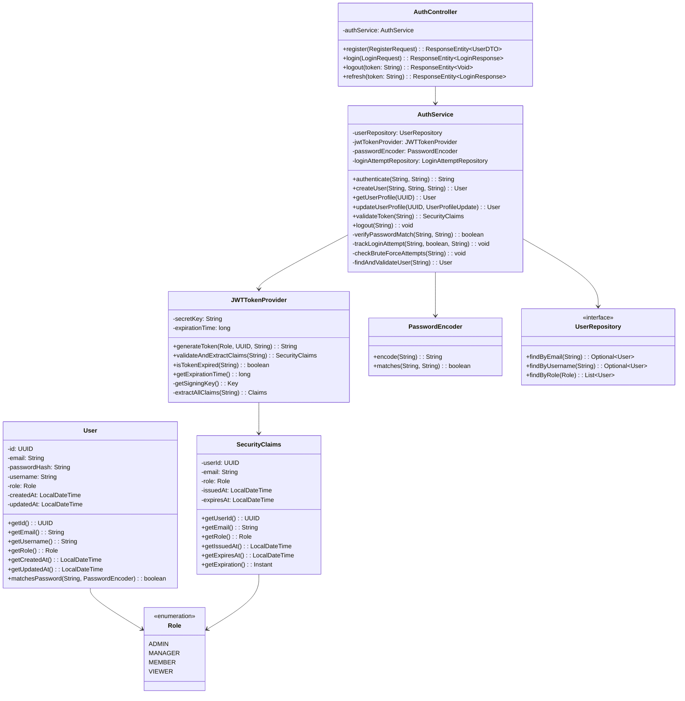
```mermaid
classDiagram
    class AuthController {
        -authService: AuthService
        +register(RegisterRequest): ResponseEntity~UserDTO~
        +login(LoginRequest): ResponseEntity~LoginResponse~
        +logout(token: String): ResponseEntity~Void~
        +refresh(token: String): ResponseEntity~LoginResponse~
    }
    
    class AuthService {
        -userRepository: UserRepository
        -jwtTokenProvider: JWTTokenProvider
        -passwordEncoder: PasswordEncoder
        -loginAttemptRepository: LoginAttemptRepository
        +authenticate(String, String): String
        +createUser(String, String, String): User
        +getUserProfile(UUID): User
        +updateUserProfile(UUID, UserProfileUpdate): User
        +validateToken(String): SecurityClaims
        +logout(String): void
        -verifyPasswordMatch(String, String): boolean
        -trackLoginAttempt(String, boolean, String): void
        -checkBruteForceAttempts(String): void
        -findAndValidateUser(String): User
    }
    
    class JWTTokenProvider {
        -secretKey: String
        -expirationTime: long
        +generateToken(Role, UUID, String): String
        +validateAndExtractClaims(String): SecurityClaims
        +isTokenExpired(String): boolean
        +getExpirationTime(): long
        -getSigningKey(): Key
        -extractAllClaims(String): Claims
    }
    
    class PasswordEncoder {
        +encode(String): String
        +matches(String, String): boolean
    }
    
    class User {
        -id: UUID
        -email: String
        -passwordHash: String
        -username: String
        -role: Role
        -createdAt: LocalDateTime
        -updatedAt: LocalDateTime
        +getId(): UUID
        +getEmail(): String
        +getUsername(): String
        +getRole(): Role
        +getCreatedAt(): LocalDateTime
        +getUpdatedAt(): LocalDateTime
        +matchesPassword(String, PasswordEncoder): boolean
    }
    
    class SecurityClaims {
        -userId: UUID
        -email: String
        -role: Role
        -issuedAt: LocalDateTime
        -expiresAt: LocalDateTime
        +getUserId(): UUID
        +getEmail(): String
        +getRole(): Role
        +getIssuedAt(): LocalDateTime
        +getExpiresAt(): LocalDateTime
        +getExpiration(): Instant
    }
    
    class Role {
        <<enumeration>>
        ADMIN
        MANAGER
        MEMBER
        VIEWER
    }
    
    class UserRepository {
        <<interface>>
        +findByEmail(String): Optional~User~
        +findByUsername(String): Optional~User~
        +findByRole(Role): List~User~
    }
    
    AuthController --> AuthService
    AuthService --> JWTTokenProvider
    AuthService --> PasswordEncoder
    AuthService --> UserRepository
    User --> Role
    JWTTokenProvider --> SecurityClaims
    SecurityClaims --> Role
```

---

## Module 2: ProjectService

**Category:** Core Domain Service  
**Used By:** WF1, WF2, WF3  
**Stability Level:** STABLE

### Features

This module provides:
- **Project CRUD operations** (create, read, update, delete)
- **Project ownership and access control** (only owner or ADMIN can modify)
- **Project listing filtered by user role and team membership**
- **Soft delete** (mark deleted but retain in database for audit)
- **Team assignment** (add/remove members to projects)
- **Project description updates** for AI re-analysis

This module does NOT provide:
- Automatic permission propagation (roles are static)
- Project templates (future enhancement)
- Bulk project operations

### Internal Architecture

ProjectService is a stateless CRUD facilitator that enforces access control at every operation. It acts as a business logic wrapper around the ProjectRepository, ensuring that users can only access projects they own or belong to. The service validates team membership and role constraints before delegating persistence to the repository.

Projects are the top-level container. All boards, cards, and meetings belong to exactly one project. The service ensures referential integrity: a project cannot be deleted while it contains active boards.

**Architecture Diagram:**

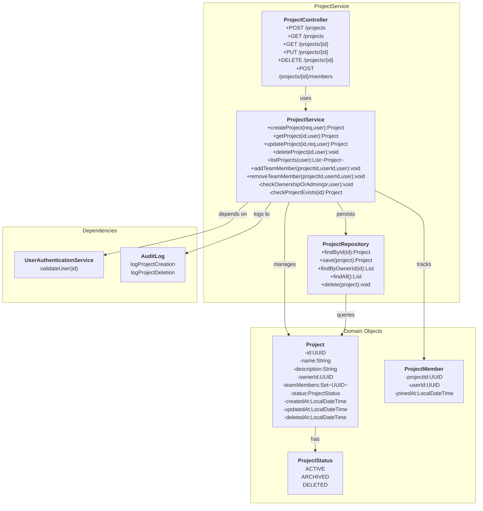
```mermaid
graph TB
    subgraph "ProjectService"
        A["<b>ProjectController</b><br/>+POST /projects<br/>+GET /projects<br/>+GET /projects/{id}<br/>+PUT /projects/{id}<br/>+DELETE /projects/{id}<br/>+POST /projects/{id}/members"]
        B["<b>ProjectService</b><br/>+createProject(req,user):Project<br/>+getProject(id,user):Project<br/>+updateProject(id,req,user):Project<br/>+deleteProject(id,user):void<br/>+listProjects(user):List~Project~<br/>+addTeamMember(projectId,userId,user):void<br/>+removeTeamMember(projectId,userId,user):void<br/>-checkOwnershipOrAdmin(pr,user):void<br/>-checkProjectExists(id):Project"]
        C["<b>ProjectRepository</b><br/>+findById(id):Project<br/>+save(project):Project<br/>+findByOwnerId(id):List<br/>+findAll():List<br/>+delete(project):void"]
    end
    
    subgraph "Domain Objects"
        D["<b>Project</b><br/>-id:UUID<br/>-name:String<br/>-description:String<br/>-ownerId:UUID<br/>-teamMembers:Set~UUID~<br/>-status:ProjectStatus<br/>-createdAt:LocalDateTime<br/>-updatedAt:LocalDateTime<br/>-deletedAt:LocalDateTime"]
        E["<b>ProjectStatus</b><br/>ACTIVE<br/>ARCHIVED<br/>DELETED"]
        F["<b>ProjectMember</b><br/>-projectId:UUID<br/>-userId:UUID<br/>-joinedAt:LocalDateTime"]
    end
    
    subgraph "Dependencies"
        G["<b>UserAuthenticationService</b><br/>validateUser(id)"]
        H["<b>AuditLog</b><br/>logProjectCreation<br/>logProjectDeletion"]
    end
    
    A -->|uses| B
    B -->|persists| C
    B -->|manages| D
    D -->|has| E
    B -->|tracks| F
    B -->|depends on| G
    B -->|logs to| H
    C -->|queries| D
```

### Design Justification

**Soft Delete Pattern:** When a project is deleted, we set `deletedAt` timestamp and `status = DELETED` rather than removing the row. This is critical because:
1. **Audit Trail** - Historical audit logs can still reference the deleted project
2. **Referential Integrity** - Old boards and cards can still reference the project
3. **Compliance** - Regulatory requirements may demand retention of project history
4. **Data Recovery** - Users can request undelete within 30 days

**Team Membership Tracking:** Team members are stored in a separate `project_members` table rather than a JSON array in the project row. This allows:
1. **Efficient Querying** - Find all projects where user X is member
2. **Audit Per Member** - Track when each user joined each project
3. **Indexed Lookups** - Composite index on (projectId, userId) for O(1) membership checks
4. **Normalization** - Each fact (user is member of project) appears exactly once

**Owner vs. Members:** Only the project owner can modify the project. Team members can view but not edit. This enforces singular responsibility and prevents accidental modifications from other team members.

### Data Abstraction (MIT 6.005)

#### Rep Invariant (Legal Values)

A valid Project object satisfies ALL of:
1. id ≠ null (UUID)
2. name ≠ null AND 1 ≤ length(name) ≤ 255
3. description = null OR length(description) ≤ 5000
4. ownerId ≠ null AND exists in users table
5. status ∈ {ACTIVE, ARCHIVED, DELETED}
6. teamMembers ≠ null AND non-empty
7. ownerId ∈ teamMembers (owner always member)
8. createdAt ≤ LocalDateTime.now()
9. updatedAt ≥ createdAt
10. If status = DELETED, then deletedAt ≠ null

Enforced by: SQL constraints + checkRep() runtime checks

#### Abstraction Function (Rep to Abstract)

AF(this) = Project where:
- All fields map directly except:
- teamMembers = {user_id : exists in project_members with project_id=this.id}
- status = DELETED if deleted_at ≠ null else this.status
- deleted_at is NOT exposed to clients

#### Invariant Preservation Contracts

Creators establish invariants:
- createProject(): name validated, user set as owner+member

Mutators preserve invariants:
- updateProject(): bounds check, immutable fields unchanged
- addTeamMember(): validates user exists, maintains non-empty set
- removeTeamMember(): **CRITICAL** Cannot remove owner; must keep non-empty
- deleteProject(): atomic status+deletedAt transaction

Representation Hiding:
- teamMembers returned as Collections.unmodifiableSet()
- deletedAt never exposed in API DTOs
- All public fields are immutable types

### Stable Storage

**Tables:**

```sql
CREATE TABLE projects (
    id UUID PRIMARY KEY DEFAULT gen_random_uuid(),
    name VARCHAR(255) NOT NULL,
    description TEXT,
    owner_id UUID NOT NULL,
    status VARCHAR(50) NOT NULL DEFAULT 'ACTIVE',
    created_at TIMESTAMP NOT NULL DEFAULT CURRENT_TIMESTAMP,
    updated_at TIMESTAMP NOT NULL DEFAULT CURRENT_TIMESTAMP,
    deleted_at TIMESTAMP,
    CONSTRAINT fk_projects_owner FOREIGN KEY (owner_id) REFERENCES users(id),
    CONSTRAINT valid_status CHECK (status IN ('ACTIVE', 'ARCHIVED', 'DELETED')),
    CONSTRAINT non_empty_name CHECK (length(name) > 0)
);

CREATE INDEX idx_projects_owner ON projects(owner_id);
CREATE INDEX idx_projects_status ON projects(status);
CREATE INDEX idx_projects_deleted ON projects(deleted_at);

CREATE TABLE project_members (
    id UUID PRIMARY KEY DEFAULT gen_random_uuid(),
    project_id UUID NOT NULL,
    user_id UUID NOT NULL,
    joined_at TIMESTAMP NOT NULL DEFAULT CURRENT_TIMESTAMP,
    CONSTRAINT fk_project_members_project FOREIGN KEY (project_id) REFERENCES projects(id) ON DELETE CASCADE,
    CONSTRAINT fk_project_members_user FOREIGN KEY (user_id) REFERENCES users(id),
    CONSTRAINT unique_membership UNIQUE (project_id, user_id)
);

CREATE INDEX idx_project_members_user ON project_members(user_id);
CREATE INDEX idx_project_members_project ON project_members(project_id);
```

### REST API Specification

#### POST /api/v1/projects

**Authentication:** Required  
**Authorization:** ADMIN, MANAGER, MEMBER can create

**Request:**
```json
{
  "name": "Q2 Product Roadmap",
  "description": "Planning features for Q2 2026 launch"
}
```

**Response (201 Created):**
```json
{
  "id": "550e8400-e29b-41d4-a716-446655440000",
  "name": "Q2 Product Roadmap",
  "description": "Planning features for Q2 2026 launch",
  "ownerId": "660e8400-e29b-41d4-a716-446655440001",
  "teamMembers": ["660e8400-e29b-41d4-a716-446655440001"],
  "status": "ACTIVE",
  "createdAt": "2026-03-17T12:00:00Z",
  "updatedAt": "2026-03-17T12:00:00Z"
}
```

**Error Responses:**
- `400 Bad Request` - Name is empty or description too long
- `401 Unauthorized` - User not authenticated

#### GET /api/v1/projects

**Authentication:** Required

**Query Parameters:**
- `status=ACTIVE|ARCHIVED|DELETED` (optional, default: ACTIVE)
- `page=0` (optional, default: 0)
- `limit=10` (optional, default: 20, max: 100)

**Response (200 OK):**
```json
{
  "content": [
    {
      "id": "550e8400-e29b-41d4-a716-446655440000",
      "name": "Q2 Product Roadmap",
      "description": "Planning features for Q2 2026 launch",
      "ownerId": "660e8400-e29b-41d4-a716-446655440001",
      "teamMembers": ["660e8400-e29b-41d4-a716-446655440001", "660e8400-e29b-41d4-a716-446655440002"],
      "status": "ACTIVE",
      "createdAt": "2026-03-17T12:00:00Z"
    }
  ],
  "totalElements": 5,
  "totalPages": 1,
  "pageNumber": 0
}
```

**Authorization Logic:** 
- ADMIN sees all projects
- MANAGER/MEMBER see only projects they own or are team members of

#### GET /api/v1/projects/{id}

**Authentication:** Required  
**Authorization:** Owner, team member, or ADMIN

**Response (200 OK):**
```json
{
  "id": "550e8400-e29b-41d4-a716-446655440000",
  "name": "Q2 Product Roadmap",
  "description": "Planning features for Q2 2026 launch",
  "ownerId": "660e8400-e29b-41d4-a716-446655440001",
  "teamMembers": ["660e8400-e29b-41d4-a716-446655440001", "660e8400-e29b-41d4-a716-446655440002"],
  "status": "ACTIVE",
  "createdAt": "2026-03-17T12:00:00Z",
  "updatedAt": "2026-03-17T12:00:00Z"
}
```

**Error Responses:**
- `404 Not Found` - Project does not exist
- `403 Forbidden` - User is not owner or team member

#### PUT /api/v1/projects/{id}

**Authentication:** Required  
**Authorization:** Owner or ADMIN only

**Request:**
```json
{
  "name": "Q2 Product Roadmap - Updated",
  "description": "Updated planning for Q2 2026 launch with new features"
}
```

**Response (200 OK):**
```json
{
  "id": "550e8400-e29b-41d4-a716-446655440000",
  "name": "Q2 Product Roadmap - Updated",
  "description": "Updated planning for Q2 2026 launch with new features",
  "ownerId": "660e8400-e29b-41d4-a716-446655440001",
  "teamMembers": ["660e8400-e29b-41d4-a716-446655440001"],
  "status": "ACTIVE",
  "updatedAt": "2026-03-17T14:00:00Z"
}
```

**Error Responses:**
- `403 Forbidden` - User is not project owner
- `404 Not Found` - Project does not exist

#### DELETE /api/v1/projects/{id}

**Authentication:** Required  
**Authorization:** Owner or ADMIN only

**Response (204 No Content)**

**Business Logic:**
- Project status is set to DELETED
- `deletedAt` is set to current timestamp
- All associated boards are soft-deleted (cascade)
- Audit log records the deletion

**Error Responses:**
- `403 Forbidden` - User is not project owner
- `404 Not Found` - Project does not exist
- `409 Conflict` - Project already deleted

#### POST /api/v1/projects/{id}/members/{userId}

**Authentication:** Required  
**Authorization:** Owner or ADMIN only

**Response (204 No Content)**

**Side Effects:**
- User is added to project team members
- Audit log records the team membership change

#### DELETE /api/v1/projects/{id}/members/{userId}

**Authentication:** Required  
**Authorization:** Owner or ADMIN only

**Response (204 No Content)**

**Business Logic:**
- Cannot remove the project owner from team members
- User is removed from project membership
- User loses access to boards and changes in this project

**Error Responses:**
- `409 Conflict` - Attempting to remove project owner

### Class Declarations

```java
package com.flowboard.project;

@RestController
@RequestMapping("/api/v1/projects")
public class ProjectController {
    public record CreateProjectRequest(String name, String description) { }
    public record UpdateProjectRequest(String name, String description) { }
    
    @PostMapping
    public ResponseEntity<ProjectDTO> createProject(
        @Valid @RequestBody CreateProjectRequest request,
        @AuthenticationPrincipal SecurityClaims claims);
    
    @GetMapping
    public ResponseEntity<Page<ProjectDTO>> listProjects(
        @RequestParam(defaultValue = "ACTIVE") String status,
        @RequestParam(defaultValue = "0") int page,
        @RequestParam(defaultValue = "20") int limit,
        @AuthenticationPrincipal SecurityClaims claims);
    
    @GetMapping("/{id}")
    public ResponseEntity<ProjectDTO> getProject(
        @PathVariable UUID id,
        @AuthenticationPrincipal SecurityClaims claims);
    
    @PutMapping("/{id}")
    public ResponseEntity<ProjectDTO> updateProject(
        @PathVariable UUID id,
        @Valid @RequestBody UpdateProjectRequest request,
        @AuthenticationPrincipal SecurityClaims claims);
    
    @DeleteMapping("/{id}")
    public ResponseEntity<Void> deleteProject(
        @PathVariable UUID id,
        @AuthenticationPrincipal SecurityClaims claims);
    
    @PostMapping("/{id}/members/{userId}")
    public ResponseEntity<Void> addTeamMember(
        @PathVariable UUID id,
        @PathVariable UUID userId,
        @AuthenticationPrincipal SecurityClaims claims);
    
    @DeleteMapping("/{id}/members/{userId}")
    public ResponseEntity<Void> removeTeamMember(
        @PathVariable UUID id,
        @PathVariable UUID userId,
        @AuthenticationPrincipal SecurityClaims claims);
}

@Service
public class ProjectService {
    public Project createProject(CreateProjectRequest request, SecurityClaims claims) 
        throws InvalidProjectException;
    
    public Project getProject(UUID projectId, SecurityClaims claims) 
        throws ProjectNotFoundException, AccessDeniedException;
    
    public Project updateProject(UUID projectId, UpdateProjectRequest request, SecurityClaims claims) 
        throws ProjectNotFoundException, AccessDeniedException, InvalidProjectException;
    
    public void deleteProject(UUID projectId, SecurityClaims claims) 
        throws ProjectNotFoundException, AccessDeniedException;
    
    public Page<Project> listProjects(SecurityClaims claims, int page, int limit, ProjectStatus status);
    
    public void addTeamMember(UUID projectId, UUID userId, SecurityClaims claims) 
        throws ProjectNotFoundException, UserNotFoundException, AccessDeniedException;
    
    public void removeTeamMember(UUID projectId, UUID userId, SecurityClaims claims) 
        throws ProjectNotFoundException, UserNotFoundException, AccessDeniedException, InvalidOperationException;
    
    private void checkOwnershipOrAdmin(Project project, SecurityClaims claims) throws AccessDeniedException;
    private void validateProjectData(String name, String description) throws InvalidProjectException;
    private Project findAndValidateProject(UUID projectId) throws ProjectNotFoundException;
}

public class Project {
    private final UUID id;
    private final String name;
    private String description;
    private final UUID ownerId;
    private Set<UUID> teamMembers;
    private ProjectStatus status;
    private final LocalDateTime createdAt;
    private LocalDateTime updatedAt;
    private LocalDateTime deletedAt;
    
    public UUID getId();
    public String getName();
    public String getDescription();
    public UUID getOwnerId();
    public Set<UUID> getTeamMembers();
    public ProjectStatus getStatus();
    public LocalDateTime getCreatedAt();
    public LocalDateTime getUpdatedAt();
    public LocalDateTime getDeletedAt();
    
    public void addTeamMember(UUID userId);
    public void removeTeamMember(UUID userId) throws InvalidOperationException;
    public boolean isTeamMember(UUID userId);
    public boolean isOwner(UUID userId);
    public void setDescription(String description);
    public void setName(String name);
    public void markDeleted();
}

public enum ProjectStatus {
    ACTIVE("Project is in use"),
    ARCHIVED("Project is archived, read-only"),
    DELETED("Project is soft-deleted, retained for audit");
}

public class ProjectMember {
    private final UUID projectId;
    private final UUID userId;
    private final LocalDateTime joinedAt;
    
    public UUID getProjectId();
    public UUID getUserId();
    public LocalDateTime getJoinedAt();
}

@Repository
public interface ProjectRepository extends JpaRepository<Project, UUID> {
    List<Project> findByOwnerId(UUID ownerId);
    List<Project> findByStatus(ProjectStatus status);
    List<Project> findByOwnerIdAndStatus(UUID ownerId, ProjectStatus status);
}

@Repository
public interface ProjectMemberRepository extends JpaRepository<ProjectMember, UUID> {
    List<ProjectMember> findByProjectId(UUID projectId);
    List<ProjectMember> findByUserId(UUID userId);
    Optional<ProjectMember> findByProjectIdAndUserId(UUID projectId, UUID userId);
    void deleteByProjectIdAndUserId(UUID projectId, UUID userId);
}
```

### Class Hierarchy Diagram

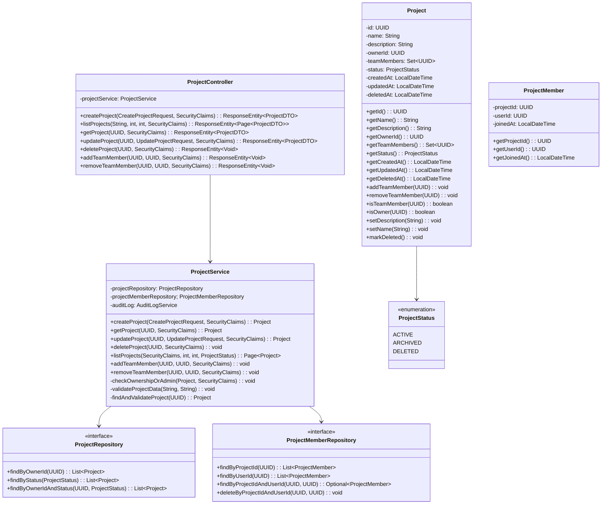
```mermaid
classDiagram
    class ProjectController {
        -projectService: ProjectService
        +createProject(CreateProjectRequest, SecurityClaims): ResponseEntity~ProjectDTO~
        +listProjects(String, int, int, SecurityClaims): ResponseEntity~Page~ProjectDTO~~
        +getProject(UUID, SecurityClaims): ResponseEntity~ProjectDTO~
        +updateProject(UUID, UpdateProjectRequest, SecurityClaims): ResponseEntity~ProjectDTO~
        +deleteProject(UUID, SecurityClaims): ResponseEntity~Void~
        +addTeamMember(UUID, UUID, SecurityClaims): ResponseEntity~Void~
        +removeTeamMember(UUID, UUID, SecurityClaims): ResponseEntity~Void~
    }
    
    class ProjectService {
        -projectRepository: ProjectRepository
        -projectMemberRepository; ProjectMemberRepository
        -auditLog: AuditLogService
        +createProject(CreateProjectRequest, SecurityClaims): Project
        +getProject(UUID, SecurityClaims): Project
        +updateProject(UUID, UpdateProjectRequest, SecurityClaims): Project
        +deleteProject(UUID, SecurityClaims): void
        +listProjects(SecurityClaims, int, int, ProjectStatus): Page~Project~
        +addTeamMember(UUID, UUID, SecurityClaims): void
        +removeTeamMember(UUID, UUID, SecurityClaims): void
        -checkOwnershipOrAdmin(Project, SecurityClaims): void
        -validateProjectData(String, String): void
        -findAndValidateProject(UUID): Project
    }
    
    class Project {
        -id: UUID
        -name: String
        -description: String
        -ownerId: UUID
        -teamMembers: Set~UUID~
        -status: ProjectStatus
        -createdAt: LocalDateTime
        -updatedAt: LocalDateTime
        -deletedAt: LocalDateTime
        +getId(): UUID
        +getName(): String
        +getDescription(): String
        +getOwnerId(): UUID
        +getTeamMembers(): Set~UUID~
        +getStatus(): ProjectStatus
        +getCreatedAt(): LocalDateTime
        +getUpdatedAt(): LocalDateTime
        +getDeletedAt(): LocalDateTime
        +addTeamMember(UUID): void
        +removeTeamMember(UUID): void
        +isTeamMember(UUID): boolean
        +isOwner(UUID): boolean
        +setDescription(String): void
        +setName(String): void
        +markDeleted(): void
    }
    
    class ProjectStatus {
        <<enumeration>>
        ACTIVE
        ARCHIVED
        DELETED
    }
    
    class ProjectRepository {
        <<interface>>
        +findByOwnerId(UUID): List~Project~
        +findByStatus(ProjectStatus): List~Project~
        +findByOwnerIdAndStatus(UUID, ProjectStatus): List~Project~
    }
    
    class ProjectMember {
        -projectId: UUID
        -userId: UUID
        -joinedAt: LocalDateTime
        +getProjectId(): UUID
        +getUserId(): UUID
        +getJoinedAt(): LocalDateTime
    }
    
    class ProjectMemberRepository {
        <<interface>>
        +findByProjectId(UUID): List~ProjectMember~
        +findByUserId(UUID): List~ProjectMember~
        +findByProjectIdAndUserId(UUID, UUID): Optional~ProjectMember~
        +deleteByProjectIdAndUserId(UUID, UUID): void
    }
    
    ProjectController --> ProjectService
    ProjectService --> ProjectRepository
    ProjectService --> ProjectMemberRepository
    Project --> ProjectStatus
```

---

## Module 3: AIEngine

**Category:** Core Domain Service  
**Used By:** WF1, WF2  
**Stability Level:** STABLE

### Features

This module provides:
- **LLM-based project analysis** for kanban board structure generation
- **Meeting summary analysis** to extract action items and decisions
- **Structured output parsing** (transforms raw LLM text to domain objects)
- **Multi-provider fallback** (OpenAI → Anthropic on failure)
- **Prompt engineering** for consistent, high-quality LLM responses
- **Token management** to avoid exceeding LLM context limits
- **Caching of LLM responses** to reduce API costs and latency

This module does NOT provide:
- Fine-tuning or model training
- Local/on-device LLM inference (cloud-based only)
- Image understanding (text embeddings only)

### Internal Architecture

AIEngine is a facade that orchestrates LLM interaction. It is passed raw user input (project description or meeting summary), constructs an optimized prompt using PromptBuilder, calls LLMClient to invoke the LLM, and then uses ContentStructurer to parse the structured response into domain objects (BoardTemplate, ActionItem, Decision, Change).

The engine implements fault tolerance with provider fallback: if OpenAI fails, it automatically retries with Anthropic. It also caches responses by input hash, so the same project description asked twice will use cached results on the second call, avoiding redundant API calls.

**Architecture Diagram:**

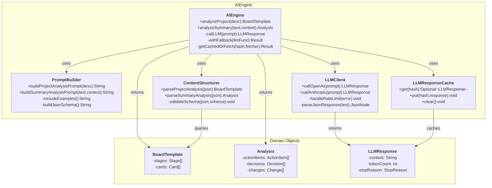
```mermaid
graph TB
    subgraph "AIEngine"
        A["<b>AIEngine</b><br/>+analyzeProject(desc):BoardTemplate<br/>+analyzeSummary(text,context):Analysis<br/>-callLLM(prompt):LLMResponse<br/>-withFallback(llmFunc):Result<br/>-getCachedOrFetch(hash,fetcher):Result"]
        B["<b>PromptBuilder</b><br/>+buildProjectAnalysisPrompt(desc):String<br/>+buildSummaryAnalysisPrompt(text,context):String<br/>-includeExamples():String<br/>-buildJsonSchema():String"]
        C["<b>LLMClient</b><br/>+callOpenAI(prompt):LLMResponse<br/>+callAnthropic(prompt):LLMResponse<br/>-handleRateLimit(error):void<br/>-parseJsonResponse(text):JsonNode"]
        D["<b>ContentStructurer</b><br/>+parseProjectAnalysis(json):BoardTemplate<br/>+parseSummaryAnalysis(json):Analysis<br/>-validateSchema(json,schema):void"]
        E["<b>LLMResponseCache</b><br/>+get(hash):Optional~LLMResponse~<br/>+put(hash,response):void<br/>+clear():void"]
    end
    
    subgraph "Domain Objects"
        F["<b>BoardTemplate</b><br/>-stages: Stage[]<br/>-cards: Card[]"]
        G["<b>Analysis</b><br/>-actionItems: ActionItem[]<br/>-decisions: Decision[]<br/>-changes: Change[]"]
        H["<b>LLMResponse</b><br/>-content: String<br/>-tokenCount: int<br/>-stopReason: StopReason"]
    end
    
    A -->|uses| B
    A -->|uses| C
    A -->|uses| D
    A -->|uses| E
    A -->|returns| F
    A -->|returns| G
    C -->|returns| H
    D -->|queries| F
    E -->|caches| H
```

### Design Justification

**Multi-Provider Fallback:** We call OpenAI first, but if it fails (rate limit, timeout, outage), we immediately retry with Anthropic. This ensures:
1. **High Availability** - If one provider is down, requests don't fail
2. **Cost Optimization** - We use cheaper provider first, expensive fallback
3. **Graceful Degradation** - If Claude is slower, users still get results
4. **Reduced Vendor Lock-in** - Either provider can be swapped without code refactoring

**Prompt Engineering in Separate Module:** Rather than embedding prompts in AIEngine, we isolate PromptBuilder. This allows:
1. **Iterative Improvement** - Tweak prompts without touching production code
2. **A/B Testing** - Compare prompt A vs. B side-by-side
3. **Reuse** - Both project and summary analysis can leverage the same few-shot examples
4. **Testability** - Mock PromptBuilder to test AIEngine logic

**Response Caching:** Expensive LLM calls (cost = $0.10-1.00, latency = 10-30s) are cached by request hash. A user asking "analyze my CRM project" twice will get instant second response at zero cost.

### Data Abstraction (MIT 6.005)

**Abstraction of LLM Provider:** Code using AIEngine never knows whether responses came from OpenAI or Anthropic. The engine abstracts this decision. If we add a third provider (Cohere), only AIEngine and LLMClient change.

**Immutability of Responses:** BoardTemplate, Analysis objects, and LLMResponse are all immutable. Once created, they cannot be modified. This ensures that cached responses cannot be accidentally mutated by callers.

**Invariant:** Every LLM call must eventually succeed (via fallback) or raise an exception. There is no "partial success" state. Either the analysis is complete or it failed.

### Stable Storage

**Tables:** No direct database writes from AIEngine. Responses are cached in-memory or in Redis (optional cache layer).

**Cache Storage (Redis, optional):**
```sql
-- Redis key-value store for LLM response cache
-- Key format: "llm_cache:{hash_of_input}"
-- Value: JSON serialized LLMResponse
-- TTL: 90 days (responses are stable unless input changes)
```

**Audit Log Entry:**
```sql
INSERT INTO audit_log (entity_type, action, actor_id, details)
VALUES ('LLM_CALL', 'ANALYZE', user_id, '{
  "input_length": 2500,
  "output_tokens": 1200,
  "provider": "openai",
  "duration_ms": 3500,
  "cache_hit": false
}');
```

### REST API Specification

Note: AIEngine is not directly called via REST endpoints. It's invoked by other services (BoardGenerator, SummaryService). However, for testing/monitoring:

#### POST /api/v1/internal/ai/analyze-project (Internal Only)

**Authentication:** System service only (not exposed to clients)

**Request:**
```json
{
  "projectDescription": "A CRM system for managing customer relationships with real-time collaboration"
}
```

**Response (200 OK):**
```json
{
  "stages": [
    {
      "name": "Backlog",
      "position": 0,
      "description": "Features to be started"
    },
    {
      "name": "In Progress",
      "position": 1,
      "description": "Features currently being developed"
    },
    {
      "name": "Testing",
      "position": 2,
      "description": "Features under QA"
    },
    {
      "name": "Done",
      "position": 3,
      "description": "Completed features"
    }
  ],
  "cards": [
    {
      "title": "User authentication",
      "description": "Implement login/registration with OAuth",
      "stageIndex": 1,
      "priority": "HIGH"
    },
    {
      "title": "Contact management",
      "description": "CRUD operations for customer contacts",
      "stageIndex": 0,
      "priority": "HIGH"
    }
  ],
  "metadata": {
    "confidence": 0.92,
    "inputTokens": 450,
    "outputTokens": 1200,
    "provider": "openai",
    "cachedResponse": false
  }
}
```

**Error Responses:**
- `503 Service Unavailable` - Both OpenAI and Anthropic are unavailable

#### POST /api/v1/internal/ai/analyze-summary (Internal Only)

**Request:**
```json
{
  "summaryText": "We discussed implementing OAuth for user auth. Decided to use Auth0. John will research pricing. Sarah will start on implementation. Action: Evaluate Auth0 vs Firebase Authentication.",
  "boardContext": {
    "existingStages": ["Backlog", "In Progress", "Done"],
    "existingCards": ["User auth", "Contact management"]
  }
}
```

**Response (200 OK):**
```json
{
  "actionItems": [
    {
      "title": "Research Auth0 pricing",
      "assignee": "John",
      "dueDate": "2026-03-24",
      "priority": "HIGH"
    },
    {
      "title": "Evaluate Auth0 vs Firebase Authentication",
      "description": "Compare features, pricing, and integration complexity",
      "owner": "Team",
      "priority": "HIGH"
    }
  ],
  "decisions": [
    {
      "title": "Use Auth0 for user authentication",
      "rationale": "Team consensus on Auth0 for OAuth implementation",
      "impact": "Reduces custom auth code, adds external dependency"
    }
  ],
  "proposedChanges": [
    {
      "type": "CREATE_CARD",
      "title": "Implement Auth0 integration",
      "description": "Integrate Auth0 SDK into application",
      "stage": "In Progress"
    },
    {
      "type": "MOVE_CARD",
      "cardTitle": "User auth",
      "fromStage": "Backlog",
      "toStage": "In Progress"
    }
  ]
}
```

### Class Declarations

```java
package com.flowboard.ai;

@Service
public class AIEngine {
    public BoardTemplate analyzeProject(String projectDescription) 
        throws LLMAnalysisException;
    
    public SummaryAnalysis analyzeSummary(String summaryText, BoardContext context) 
        throws LLMAnalysisException;
    
    public List<Change> suggestChangesFromSummary(String summaryText, String projectContext) 
        throws LLMAnalysisException;
    
    private <T> T withFallback(LLMProvider primary, LLMProvider fallback, LLMFunction<T> function) 
        throws LLMAnalysisException;
    
    private <T> T getCachedOrFetch(String inputHash, Function<String, T> fetcher);
    
    private String hashInput(String input);
}

@Component
public class PromptBuilder {
    public String buildProjectAnalysisPrompt(String projectDescription);
    public String buildSummaryAnalysisPrompt(String summaryText, BoardContext context);
    
    private String includeJsonSchema();
    private String includeFewShotExamples(String exampleType);
    private String buildConstraints();
}

@Component
public class ContentStructurer {
    public BoardTemplate parseProjectAnalysis(String jsonResponse) 
        throws ContentParsingException;
    
    public SummaryAnalysis parseSummaryAnalysis(String jsonResponse) 
        throws ContentParsingException;
    
    private void validateSchema(JsonNode json, JsonSchema schema) 
        throws SchemaValidationException;
    
    private Stage parseStage(JsonNode stageJson);
    private Card parseCard(JsonNode cardJson);
    private Change parseChange(JsonNode changeJson);
}

public class BoardTemplate {
    private final List<StageTemplate> stages;
    private final List<CardTemplate> cards;
    private final AnalysisMetadata metadata;
    
    public List<StageTemplate> getStages();
    public List<CardTemplate> getCards();
    public AnalysisMetadata getMetadata();
}

public class StageTemplate {
    private final String name;
    private final int position;
    private final String description;
    
    public String getName();
    public int getPosition();
    public String getDescription();
}

public class CardTemplate {
    private final String title;
    private final String description;
    private final int stageIndex;
    private final String priority;
    
    public String getTitle();
    public String getDescription();
    public int getStageIndex();
    public String getPriority();
}

public class SummaryAnalysis {
    private final List<ActionItem> actionItems;
    private final List<Decision> decisions;
    private final List<Change> proposedChanges;
    
    public List<ActionItem> getActionItems();
    public List<Decision> getDecisions();
    public List<Change> getProposedChanges();
}

public class ActionItem {
    private final String title;
    private final String description;
    private final String assignee;
    private final LocalDate dueDate;
    private final Priority priority;
    
    public String getTitle();
    public String getDescription();
    public String getAssignee();
    public LocalDate getDueDate();
    public Priority getPriority();
}

public class Decision {
    private final String title;
    private final String rationale;
    private final String impact;
    
    public String getTitle();
    public String getRationale();
    public String getImpact();
}

public enum Priority {
    LOW, MEDIUM, HIGH, CRITICAL;
}

public class AnalysisMetadata {
    private final double confidence;  // 0.0 - 1.0
    private final int inputTokens;
    private final int outputTokens;
    private final String provider;    // "openai" or "anthropic"
    private final boolean cachedResponse;
    private final long duration_ms;
    
    public double getConfidence();
    public int getInputTokens();
    public int getOutputTokens();
    public String getProvider();
    public boolean isCachedResponse();
    public long getDuration_ms();
}

public class LLMException extends Exception {
    public LLMException(String message);
    public LLMException(String message, Throwable cause);
}

public class LLMAnalysisException extends LLMException { }

public class ContentParsingException extends Exception { }
```

### Class Hierarchy Diagram

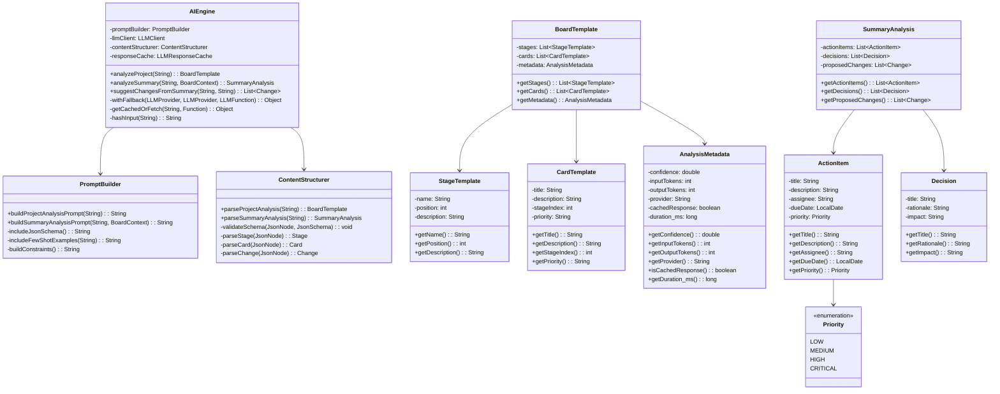
```mermaid
classDiagram
    class AIEngine {
        -promptBuilder: PromptBuilder
        -llmClient: LLMClient
        -contentStructurer: ContentStructurer
        -responseCache: LLMResponseCache
        +analyzeProject(String): BoardTemplate
        +analyzeSummary(String, BoardContext): SummaryAnalysis
        +suggestChangesFromSummary(String, String): List~Change~
        -withFallback(LLMProvider, LLMProvider, LLMFunction): Object
        -getCachedOrFetch(String, Function): Object
        -hashInput(String): String
    }
    
    class PromptBuilder {
        +buildProjectAnalysisPrompt(String): String
        +buildSummaryAnalysisPrompt(String, BoardContext): String
        -includeJsonSchema(): String
        -includeFewShotExamples(String): String
        -buildConstraints(): String
    }
    
    class ContentStructurer {
        +parseProjectAnalysis(String): BoardTemplate
        +parseSummaryAnalysis(String): SummaryAnalysis
        -validateSchema(JsonNode, JsonSchema): void
        -parseStage(JsonNode): Stage
        -parseCard(JsonNode): Card
        -parseChange(JsonNode): Change
    }
    
    class BoardTemplate {
        -stages: List~StageTemplate~
        -cards: List~CardTemplate~
        -metadata: AnalysisMetadata
        +getStages(): List~StageTemplate~
        +getCards(): List~CardTemplate~
        +getMetadata(): AnalysisMetadata
    }
    
    class StageTemplate {
        -name: String
        -position: int
        -description: String
        +getName(): String
        +getPosition(): int
        +getDescription(): String
    }
    
    class CardTemplate {
        -title: String
        -description: String
        -stageIndex: int
        -priority: String
        +getTitle(): String
        +getDescription(): String
        +getStageIndex(): int
        +getPriority(): String
    }
    
    class SummaryAnalysis {
        -actionItems: List~ActionItem~
        -decisions: List~Decision~
        -proposedChanges: List~Change~
        +getActionItems(): List~ActionItem~
        +getDecisions(): List~Decision~
        +getProposedChanges(): List~Change~
    }
    
    class ActionItem {
        -title: String
        -description: String
        -assignee: String
        -dueDate: LocalDate
        -priority: Priority
        +getTitle(): String
        +getDescription(): String
        +getAssignee(): String
        +getDueDate(): LocalDate
        +getPriority(): Priority
    }
    
    class Decision {
        -title: String
        -rationale: String
        -impact: String
        +getTitle(): String
        +getRationale(): String
        +getImpact(): String
    }
    
    class Priority {
        <<enumeration>>
        LOW
        MEDIUM
        HIGH
        CRITICAL
    }
    
    class AnalysisMetadata {
        -confidence: double
        -inputTokens: int
        -outputTokens: int
        -provider: String
        -cachedResponse: boolean
        -duration_ms: long
        +getConfidence(): double
        +getInputTokens(): int
        +getOutputTokens(): int
        +getProvider(): String
        +isCachedResponse(): boolean
        +getDuration_ms(): long
    }
    
    AIEngine --> PromptBuilder
    AIEngine --> ContentStructurer
    BoardTemplate --> StageTemplate
    BoardTemplate --> CardTemplate
    BoardTemplate --> AnalysisMetadata
    SummaryAnalysis --> ActionItem
    SummaryAnalysis --> Decision
    ActionItem --> Priority
```

---

## Module 4: BoardGenerator

**Category:** Core Domain Service  
**Used By:** WF1  
**Stability Level:** STABLE

### Features

This module provides:
- **Board creation from AI-generated templates** (from AIEngine.analyzeProject)
- **Stage creation** with ordering and metadata
- **Card population** from analysis suggestions
- **Bulk card creation** in atomic transaction
- **Board structure validation** (no empty boards, at least 2 stages)
- **Position/ordering initialization** for UI rendering

This module does NOT provide:
- Manual board editing (use individual card/stage APIs)
- Board templates (static configs)
- Board copying/duplication

### Internal Architecture

BoardGenerator is a factory that takes a BoardTemplate (output from AIEngine) and persists it to the database, creating a Project, Board, Stages, and Cards in a single atomic transaction. It validates the template structure, assigns positions to stages and cards, and ensures referential integrity.

The module wraps database operations in a transaction: if any stage or card creation fails, the entire board creation is rolled back, preventing partially-created boards.

**Architecture Diagram:**

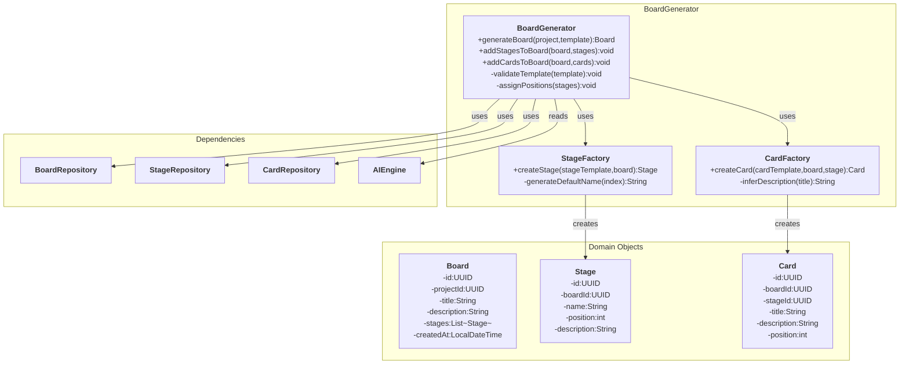
```mermaid
graph TB
    subgraph "BoardGenerator"
        A["<b>BoardGenerator</b><br/>+generateBoard(project,template):Board<br/>+addStagesToBoard(board,stages):void<br/>+addCardsToBoard(board,cards):void<br/>-validateTemplate(template):void<br/>-assignPositions(stages):void"]
        B["<b>StageFactory</b><br/>+createStage(stageTemplate,board):Stage<br/>-generateDefaultName(index):String"]
        C["<b>CardFactory</b><br/>+createCard(cardTemplate,board,stage):Card<br/>-inferDescription(title):String"]
    end
    
    subgraph "Domain Objects"
        D["<b>Board</b><br/>-id:UUID<br/>-projectId:UUID<br/>-title:String<br/>-description:String<br/>-stages:List~Stage~<br/>-createdAt:LocalDateTime"]
        E["<b>Stage</b><br/>-id:UUID<br/>-boardId:UUID<br/>-name:String<br/>-position:int<br/>-description:String"]
        F["<b>Card</b><br/>-id:UUID<br/>-boardId:UUID<br/>-stageId:UUID<br/>-title:String<br/>-description:String<br/>-position:int"]
    end
    
    subgraph "Dependencies"
        G["<b>BoardRepository</b>"]
        H["<b>StageRepository</b>"]
        I["<b>CardRepository</b>"]
        J["<b>AIEngine</b>"]
    end
    
    A -->|uses| B
    A -->|uses| C
    A -->|uses| G
    A -->|uses| H
    A -->|uses| I
    B -->|creates| E
    C -->|creates| F
    A -->|reads| J
```

### Design Justification

**Atomic Transaction:** Creating a board involves multiple database writes (Board → Stages → Cards). If we insert the board and stages successfully but fail on cards, the user sees an incomplete board. By wrapping everything in `@Transactional`, either all succeed or all rollback.

**Factory Pattern:** Rather than BoardGenerator directly creating Stage and Card objects, we delegate to StageFactory and CardFactory. This separation allows:
1. **Testing** - Mock factories without mocking repositories
2. **Customization** - Different board types could use different factories
3. **Reuse** - Factories can be used in other contexts

**Validation Before Persistence:** We validate the BoardTemplate's structure before touching the database. This fails fast and provides clear error messages (e.g., "Board must have at least 2 stages") rather than database constraint violations.

### Data Abstraction (MIT 6.005)

**Encapsulation:** The BoardGenerator hides the complexity of creating multiple related entities. Callers pass in a BoardTemplate and get back a Board. They don't need to know about the internal Stage/Card creation logic.

**Immutability:** Board, Stage, and Card objects are immutable after creation. Their primary key (id) and relationships (boardId, stageId) never change.

**Invariants:**
- Boards must belong to exactly one Project
- Stages must belong to exactly one Board
- Cards must belong to exactly one Stage
- Stages are ordered (position 0, 1, 2, ...)
- Cards within a stage are ordered

### Stable Storage

**Tables:**

```sql
CREATE TABLE boards (
    id UUID PRIMARY KEY DEFAULT gen_random_uuid(),
    project_id UUID NOT NULL,
    title VARCHAR(255) NOT NULL,
    description TEXT,
    created_at TIMESTAMP NOT NULL DEFAULT CURRENT_TIMESTAMP,
    updated_at TIMESTAMP NOT NULL DEFAULT CURRENT_TIMESTAMP,
    CONSTRAINT fk_boards_project FOREIGN KEY (project_id) REFERENCES projects(id),
    CONSTRAINT non_empty_title CHECK (length(title) > 0)
);

CREATE INDEX idx_boards_project ON boards(project_id);

CREATE TABLE stages (
    id UUID PRIMARY KEY DEFAULT gen_random_uuid(),
    board_id UUID NOT NULL,
    name VARCHAR(100) NOT NULL,
    position INT NOT NULL,
    description TEXT,
    created_at TIMESTAMP NOT NULL DEFAULT CURRENT_TIMESTAMP,
    CONSTRAINT fk_stages_board FOREIGN KEY (board_id) REFERENCES boards(id) ON DELETE CASCADE,
    CONSTRAINT valid_position CHECK (position >= 0),
    CONSTRAINT unique_stage_position UNIQUE (board_id, position),
    CONSTRAINT non_empty_name CHECK (length(name) > 0)
);

CREATE INDEX idx_stages_board ON stages(board_id);

CREATE TABLE cards (
    id UUID PRIMARY KEY DEFAULT gen_random_uuid(),
    board_id UUID NOT NULL,
    stage_id UUID NOT NULL,
    title VARCHAR(255) NOT NULL,
    description TEXT,
    position INT NOT NULL,
    created_at TIMESTAMP NOT NULL DEFAULT CURRENT_TIMESTAMP,
    updated_at TIMESTAMP NOT NULL DEFAULT CURRENT_TIMESTAMP,
    CONSTRAINT fk_cards_board FOREIGN KEY (board_id) REFERENCES boards(id) ON DELETE CASCADE,
    CONSTRAINT fk_cards_stage FOREIGN KEY (stage_id) REFERENCES stages(id),
    CONSTRAINT valid_position CHECK (position >= 0),
    CONSTRAINT non_empty_title CHECK (length(title) > 0)
);

CREATE INDEX idx_cards_board_stage ON cards(board_id, stage_id);
CREATE INDEX idx_cards_stage ON cards(stage_id);
```

### REST API Specification

#### POST /api/v1/boards

**Authentication:** Required  
**Authorization:** Can create board in own project or ADMIN

**Request:**
```json
{
  "projectId": "550e8400-e29b-41d4-a716-446655440000",
  "title": "Product Roadmap Q2 2026",
  "description": "Kanban board for tracking Q2 feature development",
  "fromAIAnalysis": true,
  "analysisInput": "Mobile app supporting real-time collaboration on kanban boards with AI-powered suggestions"
}
```

In `fromAIAnalysis` mode, the service:
1. Calls AIEngine.analyzeProject(analysisInput)
2. Receives BoardTemplate with stages and cards
3. Creates Board with auto-generated stages and cards

Alternative without AI:
```json
{
  "projectId": "550e8400-e29b-41d4-a716-446655440000",
  "title": "Manual Board",
  "description": "Manually created kanban board",
  "fromAIAnalysis": false,
  "initialStages": ["To Do", "In Progress", "Done"]
}
```

**Response (201 Created):**
```json
{
  "id": "550e8400-e29b-41d4-a716-446655440000",
  "projectId": "550e8400-e29b-41d4-a716-446655440001",
  "title": "Product Roadmap Q2 2026",
  "description": "Kanban board for tracking Q2 feature development",
  "stages": [
    {
      "id": "650e8400-e29b-41d4-a716-446655440000",
      "name": "Backlog",
      "position": 0,
      "cardCount": 3
    },
    {
      "id": "650e8400-e29b-41d4-a716-446655440001",
      "name": "In Progress",
      "position": 1,
      "cardCount": 5
    },
    {
      "id": "650e8400-e29b-41d4-a716-446655440002",
      "name": "Done",
      "position": 2,
      "cardCount": 2
    }
  ],
  "createdAt": "2026-03-17T12:00:00Z"
}
```

**Error Responses:**
- `400 Bad Request` - Project not found, title empty, or AI analysis failed
- `403 Forbidden` - User cannot create board in this project
- `503 Service Unavailable` - AIEngine unavailable (if fromAIAnalysis=true)

#### GET /api/v1/boards/{id}

**Authentication:** Required  
**Authorization:** Project member or ADMIN

**Response (200 OK):**
```json
{
  "id": "550e8400-e29b-41d4-a716-446655440000",
  "projectId": "550e8400-e29b-41d4-a716-446655440001",
  "title": "Product Roadmap Q2 2026",
  "description": "Kanban board for tracking Q2 feature development",
  "stages": [
    {
      "id": "650e8400-e29b-41d4-a716-446655440000",
      "name": "Backlog",
      "position": 0,
      "cards": [
        {
          "id": "750e8400-e29b-41d4-a716-446655440000",
          "title": "User authentication",
          "description": "Implement OAuth2 flow",
          "position": 0
        }
      ]
    }
  ],
  "createdAt": "2026-03-17T12:00:00Z"
}
```

### Class Declarations

```java
package com.flowboard.board;

@Service
@Transactional
public class BoardGenerator {
    public Board generateBoard(Project project, BoardTemplate template) 
        throws InvalidBoardTemplateException;
    
    public Board generateBoardFromAnalysis(Project project, String analysisInput) 
        throws LLMAnalysisException, InvalidBoardTemplateException;
    
    public Board createManualBoard(Project project, String title, List<String> stageNames) 
        throws InvalidBoardException;
    
    private void validateTemplate(BoardTemplate template) 
        throws InvalidBoardTemplateException;
    
    private void assignPositions(List<StageTemplate> stages);
    
    private void assignCardPositions(List<CardTemplate> cards);
}

@Component
public class StageFactory {
    public Stage createStage(StageTemplate template, Board board, int position);
    
    private String generateStageName(int index, String suggestedName);
}

@Component
public class CardFactory {
    public Card createCard(CardTemplate template, Board board, Stage stage, int position);
    
    private String inferDescription(String title);
}

public class Board {
    private final UUID id;
    private final UUID projectId;
    private final String title;
    private String description;
    private final List<Stage> stages;
    private final LocalDateTime createdAt;
    private LocalDateTime updatedAt;
    
    public UUID getId();
    public UUID getProjectId();
    public String getTitle();
    public String getDescription();
    public List<Stage> getStages();
    public LocalDateTime getCreatedAt();
    public LocalDateTime getUpdatedAt();
    
    public void setDescription(String description);
    public int getStageCount();
    public int getTotalCardCount();
    public void addStage(Stage stage);
}

public class Stage {
    private final UUID id;
    private final UUID boardId;
    private final String name;
    private final int position;
    private String description;
    private final List<Card> cards;
    
    public UUID getId();
    public UUID getBoardId();
    public String getName();
    public int getPosition();
    public String getDescription();
    public List<Card> getCards();
    
    public void setDescription(String description);
    public void addCard(Card card);
    public int getCardCount();
}

public class Card {
    private final UUID id;
    private final UUID boardId;
    private final UUID stageId;
    private String title;
    private String description;
    private final int position;
    private final LocalDateTime createdAt;
    private LocalDateTime updatedAt;
    
    public UUID getId();
    public UUID getBoardId();
    public UUID getStageId();
    public String getTitle();
    public String getDescription();
    public int getPosition();
    public LocalDateTime getCreatedAt();
    public LocalDateTime getUpdatedAt();
    
    public void setTitle(String title);
    public void setDescription(String description);
}

@Repository
public interface BoardRepository extends JpaRepository<Board, UUID> {
    List<Board> findByProjectId(UUID projectId);
}

@Repository
public interface StageRepository extends JpaRepository<Stage, UUID> {
    List<Stage> findByBoardId(UUID boardId);
    Optional<Stage> findByBoardIdAndPosition(UUID boardId, int position);
}

@Repository
public interface CardRepository extends JpaRepository<Card, UUID> {
    List<Card> findByBoardId(UUID boardId);
    List<Card> findByStageId(UUID stageId);
    List<Card> findByBoardIdAndStageId(UUID boardId, UUID stageId);
}
```

### Class Hierarchy Diagram

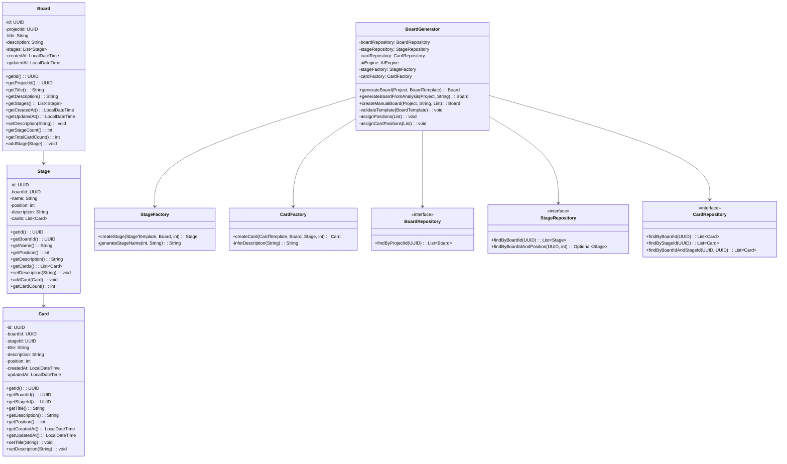
```mermaid
classDiagram
    class BoardGenerator {
        -boardRepository: BoardRepository
        -stageRepository: StageRepository
        -cardRepository: CardRepository
        -aiEngine: AIEngine
        -stageFactory: StageFactory
        -cardFactory: CardFactory
        +generateBoard(Project, BoardTemplate): Board
        +generateBoardFromAnalysis(Project, String): Board
        +createManualBoard(Project, String, List): Board
        -validateTemplate(BoardTemplate): void
        -assignPositions(List): void
        -assignCardPositions(List): void
    }
    
    class StageFactory {
        +createStage(StageTemplate, Board, int): Stage
        -generateStageName(int, String): String
    }
    
    class CardFactory {
        +createCard(CardTemplate, Board, Stage, int): Card
        -inferDescription(String): String
    }
    
    class Board {
        -id: UUID
        -projectId: UUID
        -title: String
        -description: String
        -stages: List~Stage~
        -createdAt: LocalDateTime
        -updatedAt: LocalDateTime
        +getId(): UUID
        +getProjectId(): UUID
        +getTitle(): String
        +getDescription(): String
        +getStages(): List~Stage~
        +getCreatedAt(): LocalDateTime
        +getUpdatedAt(): LocalDateTime
        +setDescription(String): void
        +getStageCount(): int
        +getTotalCardCount(): int
        +addStage(Stage): void
    }
    
    class Stage {
        -id: UUID
        -boardId: UUID
        -name: String
        -position: int
        -description: String
        -cards: List~Card~
        +getId(): UUID
        +getBoardId(): UUID
        +getName(): String
        +getPosition(): int
        +getDescription(): String
        +getCards(): List~Card~
        +setDescription(String): void
        +addCard(Card): void
        +getCardCount(): int
    }
    
    class Card {
        -id: UUID
        -boardId: UUID
        -stageId: UUID
        -title: String
        -description: String
        -position: int
        -createdAt: LocalDateTime
        -updatedAt: LocalDateTime
        +getId(): UUID
        +getBoardId(): UUID
        +getStageId(): UUID
        +getTitle(): String
        +getDescription(): String
        +getPosition(): int
        +getCreatedAt(): LocalDateTime
        +getUpdatedAt(): LocalDateTime
        +setTitle(String): void
        +setDescription(String): void
    }
    
    class BoardRepository {
        <<interface>>
        +findByProjectId(UUID): List~Board~
    }
    
    class StageRepository {
        <<interface>>
        +findByBoardId(UUID): List~Stage~
        +findByBoardIdAndPosition(UUID, int): Optional~Stage~
    }
    
    class CardRepository {
        <<interface>>
        +findByBoardId(UUID): List~Card~
        +findByStageId(UUID): List~Card~
        +findByBoardIdAndStageId(UUID, UUID): List~Card~
    }
    
    BoardGenerator --> StageFactory
    BoardGenerator --> CardFactory
    BoardGenerator --> BoardRepository
    BoardGenerator --> StageRepository
    BoardGenerator --> CardRepository
    Board --> Stage
    Stage --> Card
```

---

## Module 5: MeetingService

**Category:** Core Domain Service  
**Used By:** WF2  
**Stability Level:** STABLE

### Features

This module provides:
- **Meeting creation** linked to a project
- **Meeting lifecycle management** (active, completed, cancelled)
- **Participant tracking** (who attended)
- **Meeting note storage** (raw transcription or summary)
- **Meeting status transitions** (create → in-progress → completed)
- **Participant list updates** (add/remove participants)

This module does NOT provide:
- Real-time meeting transcription (external service)
- Audio/video recording (external service)
- Participant notifications (external service)

### Internal Architecture

MeetingService manages the lifecycle of meetings. A meeting is created for a specific project, has a set of participants, and tracks its status. When a meeting ends, notes are captured, and the meeting is marked as completed. The service ensures referential integrity: a meeting must belong to a project, and participants must be valid users.

**Architecture Diagram:**

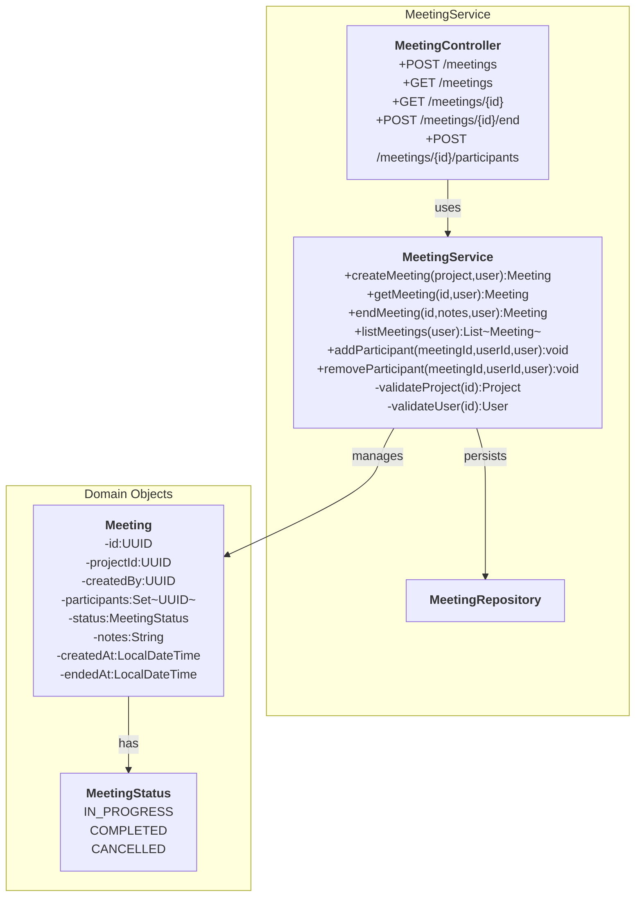
```mermaid
graph TB
    subgraph "MeetingService"
        A["<b>MeetingController</b><br/>+POST /meetings<br/>+GET /meetings<br/>+GET /meetings/{id}<br/>+POST /meetings/{id}/end<br/>+POST /meetings/{id}/participants"]
        B["<b>MeetingService</b><br/>+createMeeting(project,user):Meeting<br/>+getMeeting(id,user):Meeting<br/>+endMeeting(id,notes,user):Meeting<br/>+listMeetings(user):List~Meeting~<br/>+addParticipant(meetingId,userId,user):void<br/>+removeParticipant(meetingId,userId,user):void<br/>-validateProject(id):Project<br/>-validateUser(id):User"]
        C["<b>MeetingRepository</b>"]
    end
    
    subgraph "Domain Objects"
        D["<b>Meeting</b><br/>-id:UUID<br/>-projectId:UUID<br/>-createdBy:UUID<br/>-participants:Set~UUID~<br/>-status:MeetingStatus<br/>-notes:String<br/>-createdAt:LocalDateTime<br/>-endedAt:LocalDateTime"]
        E["<b>MeetingStatus</b><br/>IN_PROGRESS<br/>COMPLETED<br/>CANCELLED"]
    end
    
    A -->|uses| B
    B -->|persists| C
    B -->|manages| D
    D -->|has| E
```

### Design Justification

**Participant Set Storage:** Participants are stored in a separate table rather than JSON array for the same reasons as ProjectMembers:
1. Efficient querying (find all meetings where user X participated)
2. Proper normalization
3. Audit trail per participant

**Note Storage:** Meeting notes are stored as plain TEXT (or JSONB for structured transcriptions). This flexibility allows different note formats (raw transcription, structured summary, AI-generated).

**Status Transitions:** A meeting may transition from `IN_PROGRESS` to `COMPLETED` or `CANCELLED`; once terminal, it cannot transition back to `IN_PROGRESS`. This preserves lifecycle integrity and prevents accidental reopen.

### Data Abstraction (MIT 6.005)

**Immutability:** Meeting ID, project ID, and creator are immutable. Once a meeting is created, it's linked to a specific project and creator forever.

**Invariant:** A meeting in COMPLETED status must have a non-empty notes field and a non-null endedAt timestamp.

### Stable Storage

**Tables:**

```sql
CREATE TABLE meeting_sessions (
    id UUID PRIMARY KEY DEFAULT gen_random_uuid(),
    project_id UUID NOT NULL,
    created_by UUID NOT NULL,
    status VARCHAR(50) NOT NULL DEFAULT 'IN_PROGRESS',
    notes TEXT,
    created_at TIMESTAMP NOT NULL DEFAULT CURRENT_TIMESTAMP,
    ended_at TIMESTAMP,
    CONSTRAINT fk_meetings_project FOREIGN KEY (project_id) REFERENCES projects(id),
    CONSTRAINT fk_meetings_creator FOREIGN KEY (created_by) REFERENCES users(id),
    CONSTRAINT valid_status CHECK (status IN ('IN_PROGRESS', 'COMPLETED', 'CANCELLED')),
    CONSTRAINT notes_required_if_completed CHECK (status != 'COMPLETED' OR notes IS NOT NULL)
);

CREATE INDEX idx_meetings_project ON meeting_sessions(project_id);
CREATE INDEX idx_meetings_creator ON meeting_sessions(created_by);
CREATE INDEX idx_meetings_status ON meeting_sessions(status);

CREATE TABLE meeting_participants (
    id UUID PRIMARY KEY DEFAULT gen_random_uuid(),
    meeting_id UUID NOT NULL,
    user_id UUID NOT NULL,
    joined_at TIMESTAMP NOT NULL DEFAULT CURRENT_TIMESTAMP,
    CONSTRAINT fk_meeting_participants_meeting FOREIGN KEY (meeting_id) REFERENCES meeting_sessions(id) ON DELETE CASCADE,
    CONSTRAINT fk_meeting_participants_user FOREIGN KEY (user_id) REFERENCES users(id),
    CONSTRAINT unique_participant UNIQUE (meeting_id, user_id)
);

CREATE INDEX idx_meeting_participants_user ON meeting_participants(user_id);
CREATE INDEX idx_meeting_participants_meeting ON meeting_participants(meeting_id);

CREATE TABLE meeting_notes (
    id UUID PRIMARY KEY DEFAULT gen_random_uuid(),
    meeting_id UUID NOT NULL,
    note_text TEXT NOT NULL,
    note_type VARCHAR(50) NOT NULL DEFAULT 'SUMMARY',
    created_at TIMESTAMP NOT NULL DEFAULT CURRENT_TIMESTAMP,
    CONSTRAINT fk_notes_meeting FOREIGN KEY (meeting_id) REFERENCES meeting_sessions(id)
);

CREATE INDEX idx_meeting_notes_meeting ON meeting_notes(meeting_id);

CREATE TABLE summaries (
    id UUID PRIMARY KEY DEFAULT gen_random_uuid(),
    meeting_id UUID NOT NULL,
    content TEXT NOT NULL,
    status VARCHAR(50) NOT NULL DEFAULT 'PENDING_APPROVAL',
    created_by UUID NOT NULL,
    created_at TIMESTAMP NOT NULL DEFAULT CURRENT_TIMESTAMP,
    approved_at TIMESTAMP,
    rejection_reason TEXT,
    CONSTRAINT fk_summaries_meeting FOREIGN KEY (meeting_id) REFERENCES meeting_sessions(id),
    CONSTRAINT fk_summaries_user FOREIGN KEY (created_by) REFERENCES users(id),
    CONSTRAINT valid_summary_status CHECK (status IN ('DRAFT', 'PENDING_APPROVAL', 'APPROVED', 'REJECTED'))
);

CREATE INDEX idx_summaries_meeting ON summaries(meeting_id);
CREATE INDEX idx_summaries_status ON summaries(status);
```

### REST API Specification

#### POST /api/v1/meetings

**Authentication:** Required  
**Authorization:** MEMBER, MANAGER, ADMIN can create

**Request:**
```json
{
  "projectId": "550e8400-e29b-41d4-a716-446655440000",
  "title": "Q2 Planning Meeting",
  "participants": [
    "660e8400-e29b-41d4-a716-446655440001",
    "660e8400-e29b-41d4-a716-446655440002"
  ]
}
```

**Response (201 Created):**
```json
{
  "id": "750e8400-e29b-41d4-a716-446655440000",
  "projectId": "550e8400-e29b-41d4-a716-446655440000",
  "createdBy": "660e8400-e29b-41d4-a716-446655440001",
  "status": "IN_PROGRESS",
  "participants": [
    "660e8400-e29b-41d4-a716-446655440001",
    "660e8400-e29b-41d4-a716-446655440002"
  ],
  "createdAt": "2026-03-17T12:00:00Z"
}
```

#### GET /api/v1/meetings/{id}

**Authentication:** Required  
**Authorization:** Project member or ADMIN

**Response (200 OK):**
```json
{
  "id": "750e8400-e29b-41d4-a716-446655440000",
  "projectId": "550e8400-e29b-41d4-a716-446655440000",
  "createdBy": "660e8400-e29b-41d4-a716-446655440001",
  "status": "IN_PROGRESS",
  "participants": ["660e8400-e29b-41d4-a716-446655440001", "660e8400-e29b-41d4-a716-446655440002"],
  "notes": null,
  "createdAt": "2026-03-17T12:00:00Z",
  "endedAt": null
}
```

#### POST /api/v1/meetings/{id}/end

**Authentication:** Required  
**Authorization:** Meeting creator or ADMIN only

**Request:**
```json
{
  "notes": "Discussed Q2 features. Decided on: Auth integration (John), Contact management (Sarah), Real-time sync (Bob). John to research Auth0 pricing by Friday.",
  "audioTranscript": "(optional: full meeting transcript)"
}
```

**Response (200 OK):**
```json
{
  "id": "750e8400-e29b-41d4-a716-446655440000",
  "projectId": "550e8400-e29b-41d4-a716-446655440000",
  "createdBy": "660e8400-e29b-41d4-a716-446655440001",
  "status": "COMPLETED",
  "participants": ["660e8400-e29b-41d4-a716-446655440001"],
  "notes": "Discussed Q2 features...",
  "endedAt": "2026-03-17T13:30:00Z"
}
```

### Class Declarations

```java
package com.flowboard.meeting;

@RestController
@RequestMapping("/api/v1/meetings")
public class MeetingController {
    public record CreateMeetingRequest(UUID projectId, String title, List<UUID> participants) { }
    public record EndMeetingRequest(String notes, String audioTranscript) { }
    
    @PostMapping
    public ResponseEntity<MeetingDTO> createMeeting(
        @Valid @RequestBody CreateMeetingRequest request,
        @AuthenticationPrincipal SecurityClaims claims);
    
    @GetMapping("/{id}")
    public ResponseEntity<MeetingDTO> getMeeting(
        @PathVariable UUID id,
        @AuthenticationPrincipal SecurityClaims claims);
    
    @PostMapping("/{id}/end")
    public ResponseEntity<MeetingDTO> endMeeting(
        @PathVariable UUID id,
        @Valid @RequestBody EndMeetingRequest request,
        @AuthenticationPrincipal SecurityClaims claims);
    
    @GetMapping
    public ResponseEntity<List<MeetingDTO>> listMeetings(
        @AuthenticationPrincipal SecurityClaims claims);
}

@Service
public class MeetingService {
    public Meeting createMeeting(UUID projectId, List<UUID> participants, SecurityClaims claims) 
        throws ProjectNotFoundException, InvalidMeetingException;
    
    public Meeting getMeeting(UUID meetingId, SecurityClaims claims) 
        throws MeetingNotFoundException, AccessDeniedException;
    
    public Meeting endMeeting(UUID meetingId, String notes, SecurityClaims claims) 
        throws MeetingNotFoundException, AccessDeniedException, InvalidMeetingStateException;
    
    public Meeting addParticipant(UUID meetingId, UUID userId, SecurityClaims claims) 
        throws MeetingNotFoundException, UserNotFoundException, AccessDeniedException;
    
    public Meeting removeParticipant(UUID meetingId, UUID userId, SecurityClaims claims) 
        throws MeetingNotFoundException, UserNotFoundException, AccessDeniedException;
    
    public List<Meeting> listMeetings(SecurityClaims claims);
    
    private Project validateProject(UUID projectId) throws ProjectNotFoundException;
    private User validateUser(UUID userId) throws UserNotFoundException;
}

public class Meeting {
    private final UUID id;
    private final UUID projectId;
    private final UUID createdBy;
    private Set<UUID> participants;
    private MeetingStatus status;
    private String notes;
    private final LocalDateTime createdAt;
    private LocalDateTime endedAt;
    
    public UUID getId();
    public UUID getProjectId();
    public UUID getCreatedBy();
    public Set<UUID> getParticipants();
    public MeetingStatus getStatus();
    public String getNotes();
    public LocalDateTime getCreatedAt();
    public LocalDateTime getEndedAt();
    
    public void addParticipant(UUID userId);
    public void removeParticipant(UUID userId);
    public void endWithNotes(String notes);
    public void cancel();
}

public enum MeetingStatus {
    IN_PROGRESS("Meeting is currently active"),
    COMPLETED("Meeting has ended"),
    CANCELLED("Meeting was cancelled");
}

@Repository
public interface MeetingSessionRepository extends JpaRepository<Meeting, UUID> {
    List<Meeting> findByProjectId(UUID projectId);
    List<Meeting> findByCreatedBy(UUID createdBy);
    List<Meeting> findByStatus(MeetingStatus status);
}

@Repository
public interface MeetingParticipantRepository extends JpaRepository<MeetingParticipant, UUID> {
    List<MeetingParticipant> findByMeetingId(UUID meetingId);
    List<MeetingParticipant> findByUserId(UUID userId);
    Optional<MeetingParticipant> findByMeetingIdAndUserId(UUID meetingId, UUID userId);
}
```

### Class Hierarchy Diagram

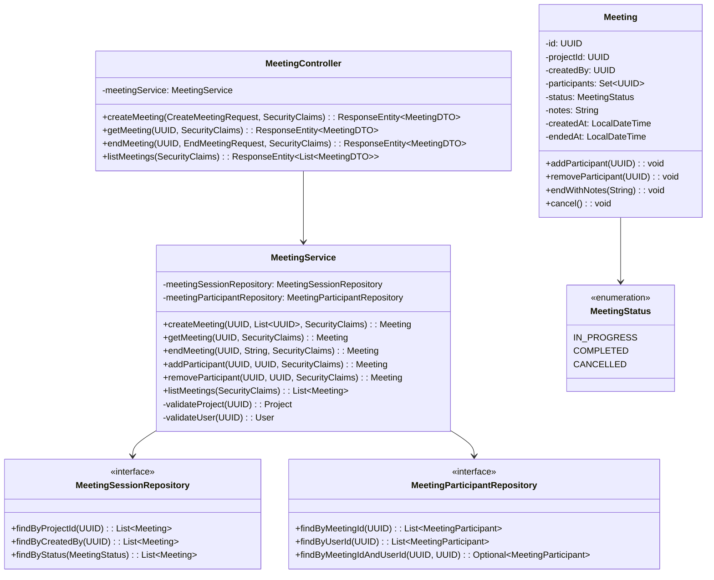
```mermaid
classDiagram
    class MeetingController {
        -meetingService: MeetingService
        +createMeeting(CreateMeetingRequest, SecurityClaims): ResponseEntity~MeetingDTO~
        +getMeeting(UUID, SecurityClaims): ResponseEntity~MeetingDTO~
        +endMeeting(UUID, EndMeetingRequest, SecurityClaims): ResponseEntity~MeetingDTO~
        +listMeetings(SecurityClaims): ResponseEntity~List~MeetingDTO~~
    }

    class MeetingService {
        -meetingSessionRepository: MeetingSessionRepository
        -meetingParticipantRepository: MeetingParticipantRepository
        +createMeeting(UUID, List~UUID~, SecurityClaims): Meeting
        +getMeeting(UUID, SecurityClaims): Meeting
        +endMeeting(UUID, String, SecurityClaims): Meeting
        +addParticipant(UUID, UUID, SecurityClaims): Meeting
        +removeParticipant(UUID, UUID, SecurityClaims): Meeting
        +listMeetings(SecurityClaims): List~Meeting~
        -validateProject(UUID): Project
        -validateUser(UUID): User
    }

    class Meeting {
        -id: UUID
        -projectId: UUID
        -createdBy: UUID
        -participants: Set~UUID~
        -status: MeetingStatus
        -notes: String
        -createdAt: LocalDateTime
        -endedAt: LocalDateTime
        +addParticipant(UUID): void
        +removeParticipant(UUID): void
        +endWithNotes(String): void
        +cancel(): void
    }

    class MeetingStatus {
        <<enumeration>>
        IN_PROGRESS
        COMPLETED
        CANCELLED
    }

    class MeetingSessionRepository {
        <<interface>>
        +findByProjectId(UUID): List~Meeting~
        +findByCreatedBy(UUID): List~Meeting~
        +findByStatus(MeetingStatus): List~Meeting~
    }

    class MeetingParticipantRepository {
        <<interface>>
        +findByMeetingId(UUID): List~MeetingParticipant~
        +findByUserId(UUID): List~MeetingParticipant~
        +findByMeetingIdAndUserId(UUID, UUID): Optional~MeetingParticipant~
    }

    MeetingController --> MeetingService
    MeetingService --> MeetingSessionRepository
    MeetingService --> MeetingParticipantRepository
    Meeting --> MeetingStatus
```

---

## Module 6: SummaryService

**Category:** Core Domain Service  
**Used By:** WF2  
**Stability Level:** STABLE

### Features

This module provides:
- **Meeting summary generation** from raw notes using AIEngine
- **Change suggestion extraction** from summaries as Change records
- **Summary approval workflow orchestration** 
- **Batch change creation** from summary analysis
- **Summary storage and retrieval**

This module does NOT provide:
- Real-time summary generation during meeting
- Speaker identification
- Sentiment analysis

### Internal Architecture

SummaryService coordinates four collaborating components: `MeetingGateway` (context loading), `AIEngine` (semantic extraction), `ContentStructurer` (strict parsing), and `ApprovalService` (summary approval kickoff). The module persists a `summary` aggregate and a batch of derived `changes` in a single transaction so WF3 always sees a consistent change set.

**Architecture Diagram:**

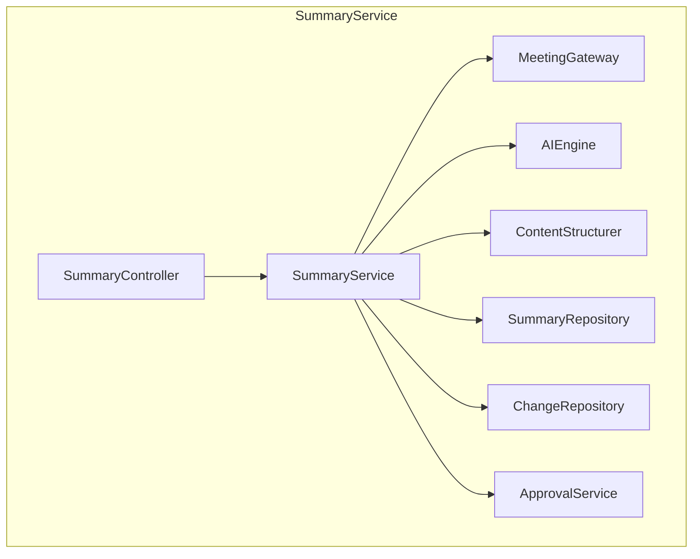
```mermaid
graph TB
    subgraph "SummaryService"
        A["SummaryController"]
        B["SummaryService"]
        C["MeetingGateway"]
        D["AIEngine"]
        E["ContentStructurer"]
        F["SummaryRepository"]
        G["ChangeRepository"]
        H["ApprovalService"]
    end

    A --> B
    B --> C
    B --> D
    B --> E
    B --> F
    B --> G
    B --> H
```

### Design Justification

1. **Transaction boundary around summary + changes:** prevents partial persistence where summary exists but no changes were written.
2. **Explicit gateway dependency:** avoids tight coupling to meeting internals and supports future split to dedicated meeting microservice.
3. **Approval kickoff inside module:** keeps WF2 ownership of summary lifecycle and prevents controller-level orchestration leakage.

### Data Abstraction (MIT 6.005)

`Summary` abstracts AI-derived meeting conclusions into a stable decision package.

**Rep Invariant:**
1. `id != null`
2. `meetingId != null`
3. `status in {DRAFT, PENDING_APPROVAL, APPROVED, REJECTED}`
4. `content != null && length(content) > 0`
5. `createdAt <= now`
6. `approvedAt != null` iff `status == APPROVED`

**Abstraction Function:**
`AF(rep) = MeetingSummary{meetingId, narrative, extractedActionItems, extractedDecisions, extractedChanges, approvalStatus}`

### Stable Storage

```sql
CREATE TABLE summaries (
    id UUID PRIMARY KEY DEFAULT gen_random_uuid(),
    meeting_id UUID NOT NULL,
    content TEXT NOT NULL,
    status VARCHAR(50) NOT NULL DEFAULT 'PENDING_APPROVAL',
    created_by UUID NOT NULL,
    created_at TIMESTAMP NOT NULL DEFAULT CURRENT_TIMESTAMP,
    approved_at TIMESTAMP,
    rejection_reason TEXT,
    CONSTRAINT fk_summaries_meeting FOREIGN KEY (meeting_id) REFERENCES meeting_sessions(id),
    CONSTRAINT fk_summaries_user FOREIGN KEY (created_by) REFERENCES users(id),
    CONSTRAINT valid_summary_status CHECK (status IN ('DRAFT', 'PENDING_APPROVAL', 'APPROVED', 'REJECTED'))
);

CREATE INDEX idx_summaries_meeting ON summaries(meeting_id);
CREATE INDEX idx_summaries_status ON summaries(status);
```

### REST API Specification

#### POST /api/v1/summaries

**Authentication:** Required  
**Authorization:** Meeting creator, participant, or ADMIN

**Request:**
```json
{
  "meetingId": "750e8400-e29b-41d4-a716-446655440000",
  "notes": "Discussed onboarding flow redesign and API throttling changes."
}
```

**Response (201 Created):**
```json
{
  "summaryId": "a50e8400-e29b-41d4-a716-446655440000",
  "meetingId": "750e8400-e29b-41d4-a716-446655440000",
  "status": "PENDING_APPROVAL",
  "changeCount": 4
}
```

#### GET /api/v1/summaries/{id}

**Authentication:** Required  
**Authorization:** Project member or ADMIN

#### POST /api/v1/summaries/{id}/approve

**Authentication:** Required  
**Authorization:** Required approver list member or ADMIN

#### POST /api/v1/summaries/{id}/reject

**Authentication:** Required  
**Authorization:** Required approver list member or ADMIN

### Class Declarations

```java
package com.flowboard.summary;

@RestController
@RequestMapping("/api/v1/summaries")
public class SummaryController {
    public record GenerateSummaryRequest(UUID meetingId, String notes) { }

    @PostMapping
    public ResponseEntity<SummaryDTO> generateSummary(
        @Valid @RequestBody GenerateSummaryRequest request,
        @AuthenticationPrincipal SecurityClaims claims);

    @GetMapping("/{id}")
    public ResponseEntity<SummaryDTO> getSummary(
        @PathVariable UUID id,
        @AuthenticationPrincipal SecurityClaims claims);

    @PostMapping("/{id}/approve")
    public ResponseEntity<Void> approveSummary(
        @PathVariable UUID id,
        @AuthenticationPrincipal SecurityClaims claims);

    @PostMapping("/{id}/reject")
    public ResponseEntity<Void> rejectSummary(
        @PathVariable UUID id,
        @RequestBody RejectSummaryRequest request,
        @AuthenticationPrincipal SecurityClaims claims);
}

@Service
public class SummaryService {
    public Summary generateSummary(UUID meetingId, String notes, SecurityClaims claims);
    public Summary getSummary(UUID summaryId, SecurityClaims claims);
    public List<Change> extractChangesFromSummary(Summary summary);
    public void approveSummary(UUID summaryId, SecurityClaims claims);
    public void rejectSummary(UUID summaryId, String reason, SecurityClaims claims);

    private void validateMeetingAccess(UUID meetingId, SecurityClaims claims);
    private void checkSummaryStateTransition(Summary summary, SummaryStatus target);
}

public class Summary {
    private final UUID id;
    private final UUID meetingId;
    private final String content;
    private SummaryStatus status;
    private final UUID createdBy;
    private final LocalDateTime createdAt;
    private LocalDateTime approvedAt;
    private String rejectionReason;

    public UUID getId();
    public UUID getMeetingId();
    public String getContent();
    public SummaryStatus getStatus();
    public UUID getCreatedBy();
    public LocalDateTime getCreatedAt();
    public LocalDateTime getApprovedAt();
    public String getRejectionReason();

    public void markApproved(LocalDateTime at);
    public void markRejected(String reason);
}

public enum SummaryStatus {
    DRAFT,
    PENDING_APPROVAL,
    APPROVED,
    REJECTED;
}

@Repository
public interface SummaryRepository extends JpaRepository<Summary, UUID> {
    List<Summary> findByMeetingId(UUID meetingId);
    List<Summary> findByStatus(SummaryStatus status);
}
```

### Class Hierarchy Diagram

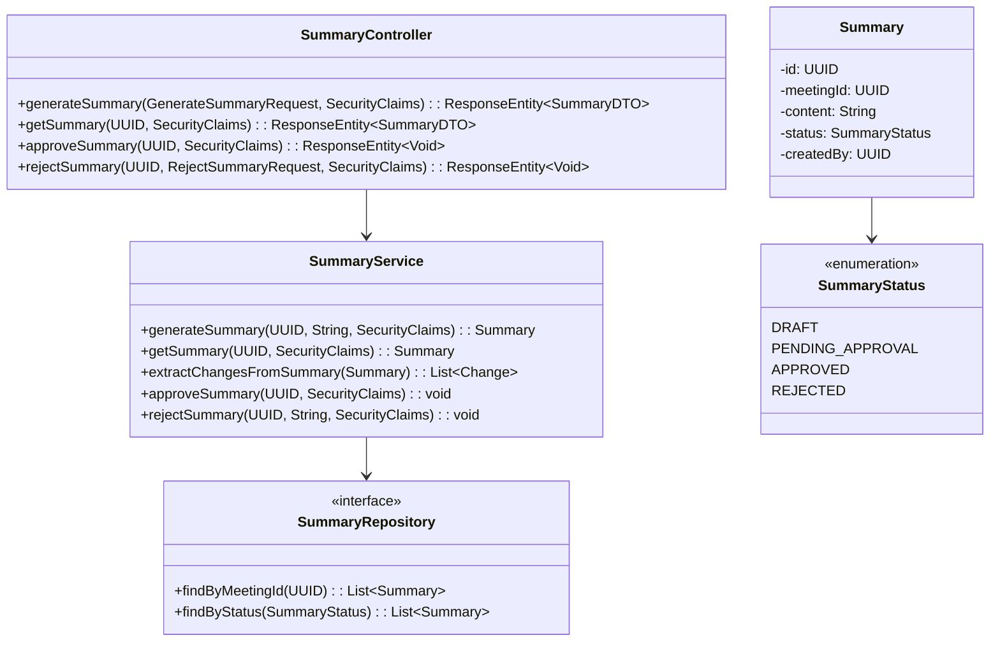
```mermaid
classDiagram
    class SummaryController {
        +generateSummary(GenerateSummaryRequest, SecurityClaims): ResponseEntity~SummaryDTO~
        +getSummary(UUID, SecurityClaims): ResponseEntity~SummaryDTO~
        +approveSummary(UUID, SecurityClaims): ResponseEntity~Void~
        +rejectSummary(UUID, RejectSummaryRequest, SecurityClaims): ResponseEntity~Void~
    }

    class SummaryService {
        +generateSummary(UUID, String, SecurityClaims): Summary
        +getSummary(UUID, SecurityClaims): Summary
        +extractChangesFromSummary(Summary): List~Change~
        +approveSummary(UUID, SecurityClaims): void
        +rejectSummary(UUID, String, SecurityClaims): void
    }

    class Summary {
        -id: UUID
        -meetingId: UUID
        -content: String
        -status: SummaryStatus
        -createdBy: UUID
    }

    class SummaryStatus {
        <<enumeration>>
        DRAFT
        PENDING_APPROVAL
        APPROVED
        REJECTED
    }

    class SummaryRepository {
        <<interface>>
        +findByMeetingId(UUID): List~Summary~
        +findByStatus(SummaryStatus): List~Summary~
    }

    SummaryController --> SummaryService
    SummaryService --> SummaryRepository
    Summary --> SummaryStatus
```

---

## Module 7: ApprovalService

**Category:** Core Domain Service  
**Used By:** WF2, WF3  
**Stability Level:** STABLE

### Features

This module provides:
- **Pluggable approval rules** (consensus, quorum, unanimous)
- **Approval request creation** with deadline
- **Vote recording** (approve/reject with feedback)
- **Approval decision evaluation** based on configurable rules
- **Notification dispatch** when approval is needed or completed
- **Audit trail** of all approval decisions

This module does NOT provide:
- Email notifications (delegates to NotificationService)
- Workflow state persistence for target business entities (summary/change records are transitioned by caller modules)

### Internal Architecture

ApprovalService acts as a generic approval orchestrator that binds an `ApprovalRequest` entity to a pluggable rule strategy (`UNANIMOUS`, `QUORUM`, `CONSENSUS`) and a vote stream. It is reused in WF2 (summary approvals) and WF3 (change approvals) with different policy inputs.

**Architecture Diagram:**

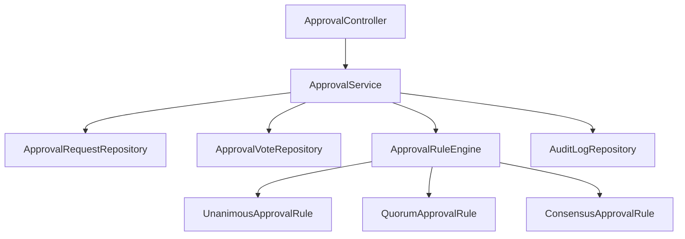
```mermaid
graph TB
    A[ApprovalController] --> B[ApprovalService]
    B --> C[ApprovalRequestRepository]
    B --> D[ApprovalVoteRepository]
    B --> E[ApprovalRuleEngine]
    E --> F[UnanimousApprovalRule]
    E --> G[QuorumApprovalRule]
    E --> H[ConsensusApprovalRule]
    B --> I[AuditLogRepository]
```

### Design Justification

1. **Rule strategy abstraction:** avoids hardcoding workflow-specific policy in a shared service.
2. **Vote immutability:** every vote is append-only with unique `(requestId, voterId)`; simplifies audit and dispute resolution.
3. **Shared service reuse:** WF2 and WF3 can diverge in policy while retaining consistent operational controls.

### Data Abstraction (MIT 6.005)

`ApprovalRequest` abstracts approval state as a deterministic function of votes and rule.

**Rep Invariant:**
1. `requiredApprovers` is non-empty
2. `status in {PENDING, APPROVED, REJECTED, EXPIRED}`
3. `deadline >= createdAt`
4. `ruleType in {UNANIMOUS, QUORUM, CONSENSUS}`
5. at most one vote per `(requestId, voterId)`

### Stable Storage

```sql
CREATE TABLE approval_requests (
    id UUID PRIMARY KEY DEFAULT gen_random_uuid(),
    entity_type VARCHAR(100) NOT NULL,
    entity_id UUID NOT NULL,
    rule_type VARCHAR(50) NOT NULL,
    status VARCHAR(50) NOT NULL DEFAULT 'PENDING',
    required_approvers JSONB NOT NULL,
    created_at TIMESTAMP NOT NULL DEFAULT CURRENT_TIMESTAMP,
    deadline TIMESTAMP,
    CONSTRAINT valid_approval_rule CHECK (rule_type IN ('UNANIMOUS', 'QUORUM', 'CONSENSUS')),
    CONSTRAINT valid_approval_status CHECK (status IN ('PENDING', 'APPROVED', 'REJECTED', 'EXPIRED'))
);

CREATE TABLE approval_votes (
    id UUID PRIMARY KEY DEFAULT gen_random_uuid(),
    approval_request_id UUID NOT NULL,
    voter_id UUID NOT NULL,
    decision VARCHAR(50) NOT NULL,
    feedback TEXT,
    voted_at TIMESTAMP NOT NULL DEFAULT CURRENT_TIMESTAMP,
    CONSTRAINT fk_approval_votes_request FOREIGN KEY (approval_request_id) REFERENCES approval_requests(id),
    CONSTRAINT fk_approval_votes_voter FOREIGN KEY (voter_id) REFERENCES users(id),
    CONSTRAINT valid_vote_decision CHECK (decision IN ('APPROVE', 'REJECT')),
    CONSTRAINT unique_vote UNIQUE (approval_request_id, voter_id)
);
```

### REST API Specification

#### POST /api/v1/approvals/requests

**Authentication:** Required  
**Authorization:** SYSTEM, MANAGER, or ADMIN

#### POST /api/v1/approvals/requests/{id}/votes

**Authentication:** Required  
**Authorization:** User must be in required approvers set

#### GET /api/v1/approvals/requests/{id}

**Authentication:** Required  
**Authorization:** Request participant or ADMIN

### Class Declarations

```java
@Service
public class ApprovalService {
    public ApprovalRequest createApprovalRequest(ApprovalContext context, ApprovalRule rule)
        throws InvalidApprovalContextException;
    
    public void recordApprovalVote(UUID requestId, UUID voterId, ApprovalDecision decision, String feedback)
        throws ApprovalNotFoundException, VoterNotFoundException;
    
    public ApprovalResult evaluateApprovalStatus(UUID requestId)
        throws ApprovalNotFoundException;
    
    public void notifyApproversNeeded(UUID requestId)
        throws ApprovalNotFoundException;
}
```

### Approval Rules

```java
public interface ApprovalRule {
    ApprovalResult evaluate(List<ApprovalVote> votes, List<UUID> requiredApprovers);
}

public class UnanimousApprovalRule implements ApprovalRule;
public class QuorumApprovalRule implements ApprovalRule; // 50% + 1
public class ConsensusApprovalRule implements ApprovalRule; // 100%
```

```java
public class ApprovalRequest {
    private final UUID id;
    private final String entityType;
    private final UUID entityId;
    private final ApprovalRuleType ruleType;
    private ApprovalStatus status;
    private final Set<UUID> requiredApprovers;
    private final LocalDateTime createdAt;
    private final LocalDateTime deadline;

    public UUID getId();
    public String getEntityType();
    public UUID getEntityId();
    public ApprovalRuleType getRuleType();
    public ApprovalStatus getStatus();
    public Set<UUID> getRequiredApprovers();

    public void markApproved();
    public void markRejected();
    public void markExpired();
}

public class ApprovalVote {
    private final UUID id;
    private final UUID approvalRequestId;
    private final UUID voterId;
    private final ApprovalDecision decision;
    private final String feedback;
    private final LocalDateTime votedAt;
}

public enum ApprovalRuleType { UNANIMOUS, QUORUM, CONSENSUS; }
public enum ApprovalStatus { PENDING, APPROVED, REJECTED, EXPIRED; }
public enum ApprovalDecision { APPROVE, REJECT; }

@Repository
public interface ApprovalRequestRepository extends JpaRepository<ApprovalRequest, UUID> {
    Optional<ApprovalRequest> findByEntityTypeAndEntityId(String entityType, UUID entityId);
    List<ApprovalRequest> findByStatus(ApprovalStatus status);
}

@Repository
public interface ApprovalVoteRepository extends JpaRepository<ApprovalVote, UUID> {
    List<ApprovalVote> findByApprovalRequestId(UUID requestId);
    Optional<ApprovalVote> findByApprovalRequestIdAndVoterId(UUID requestId, UUID voterId);
}
```

### Class Hierarchy Diagram

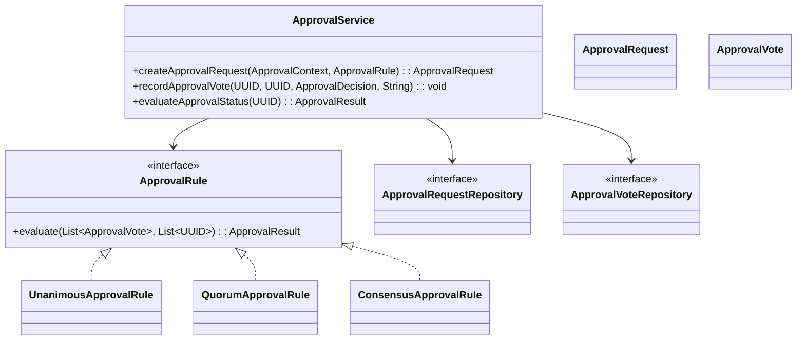
```mermaid
classDiagram
    class ApprovalService {
        +createApprovalRequest(ApprovalContext, ApprovalRule): ApprovalRequest
        +recordApprovalVote(UUID, UUID, ApprovalDecision, String): void
        +evaluateApprovalStatus(UUID): ApprovalResult
    }

    class ApprovalRule {
        <<interface>>
        +evaluate(List~ApprovalVote~, List~UUID~): ApprovalResult
    }

    class UnanimousApprovalRule
    class QuorumApprovalRule
    class ConsensusApprovalRule

    class ApprovalRequest
    class ApprovalVote
    class ApprovalRequestRepository {
        <<interface>>
    }
    class ApprovalVoteRepository {
        <<interface>>
    }

    ApprovalService --> ApprovalRequestRepository
    ApprovalService --> ApprovalVoteRepository
    ApprovalService --> ApprovalRule
    ApprovalRule <|.. UnanimousApprovalRule
    ApprovalRule <|.. QuorumApprovalRule
    ApprovalRule <|.. ConsensusApprovalRule
```

---

## Module 8: ChangePreviewService

**Category:** Core Domain Service  
**Used By:** WF3  
**Stability Level:** STABLE

### Features

This module provides:
- **Change visualization** (before/after state display)
- **Diff computation** (field-level changes)
- **Impact analysis** (which cards/stages affected)
- **Conflict detection** (changes that conflict with current state)
- **Risk assessment** (effort, complexity, risk level)
- **Change filtering and sorting** (by status, impact, risk)

This module does NOT provide:
- Change application (that's ChangeApplicationService)
- Conflict resolution (that's ConflictResolver)

### Internal Architecture

ChangePreviewService builds a read-model for reviewers by composing data from `ChangeRepository`, `KanbanBoardGateway`, `DiffCalculator`, `ImpactAnalyzer`, and `ConflictResolver`. It intentionally has no write path except reviewer metadata reads to remain side-effect free.

**Architecture Diagram:**

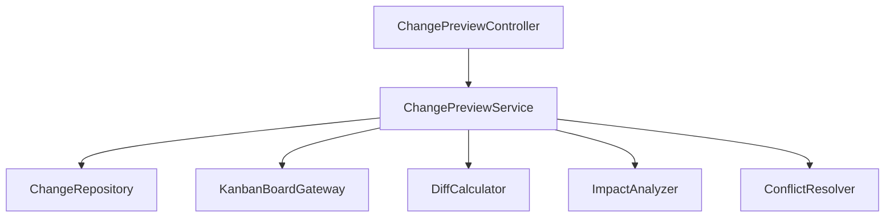
```mermaid
graph TB
    A[ChangePreviewController] --> B[ChangePreviewService]
    B --> C[ChangeRepository]
    B --> D[KanbanBoardGateway]
    B --> E[DiffCalculator]
    B --> F[ImpactAnalyzer]
    B --> G[ConflictResolver]
```

### Design Justification

1. **Read-only preview model:** protects production board state during review.
2. **Separation of analysis concerns:** diff, impact, and conflict each evolve independently.
3. **Deterministic rendering:** preview output is reproducible from persisted `current_state` and `proposed_state`.

### Data Abstraction (MIT 6.005)

`ChangePreview` abstracts all reviewer-relevant facts for a `Change` without exposing internal storage details.

**Rep Invariant:**
1. `changeId != null`
2. `diff != null`
3. `impact != null`
4. `conflicts` list is non-null
5. `status in {PENDING, READY_FOR_WF3, APPROVED, REJECTED, APPLIED}`

### Stable Storage

The module itself is stateless. Its durable inputs come from:
1. `changes` table (`current_state`, `proposed_state`, status)
2. board state (`boards`, `stages`, `cards`)
3. optional reviewer annotations in `change_review_notes`

```sql
CREATE TABLE change_review_notes (
    id UUID PRIMARY KEY DEFAULT gen_random_uuid(),
    change_id UUID NOT NULL,
    author_id UUID NOT NULL,
    note TEXT NOT NULL,
    created_at TIMESTAMP NOT NULL DEFAULT CURRENT_TIMESTAMP,
    CONSTRAINT fk_review_note_change FOREIGN KEY (change_id) REFERENCES changes(id),
    CONSTRAINT fk_review_note_author FOREIGN KEY (author_id) REFERENCES users(id)
);
```

### REST API Specification

#### GET /api/v1/changes

Lists pending/review-ready changes with summary impact metadata.

#### GET /api/v1/changes/{id}

Returns full change preview.

#### GET /api/v1/changes/{id}/diff

Returns normalized diff payload.

#### GET /api/v1/changes/{id}/impact

Returns impact and risk assessment.

### Class Declarations

```java
@Service
public class ChangePreviewService {
    public ChangePreview generatePreview(UUID changeId, SecurityClaims claims)
        throws ChangeNotFoundException, AccessDeniedException;
    
    public List<ChangePreview> listPendingChanges(UUID projectId, SecurityClaims claims);
    
    public ChangeImpactAnalysis analyzeImpact(UUID changeId)
        throws ChangeNotFoundException;
    
    public ConflictReport detectConflicts(UUID changeId)
        throws ChangeNotFoundException;
}
```

```java
public class ChangePreview {
    private final UUID changeId;
    private final ChangeType type;
    private final DiffView diff;
    private final ChangeImpactAnalysis impact;
    private final List<Conflict> conflicts;
    private final ChangeStatus status;

    public UUID getChangeId();
    public ChangeType getType();
    public DiffView getDiff();
    public ChangeImpactAnalysis getImpact();
    public List<Conflict> getConflicts();
    public ChangeStatus getStatus();
}

@Repository
public interface ChangeReviewNoteRepository extends JpaRepository<ChangeReviewNote, UUID> {
    List<ChangeReviewNote> findByChangeId(UUID changeId);
}
```

### Class Hierarchy Diagram

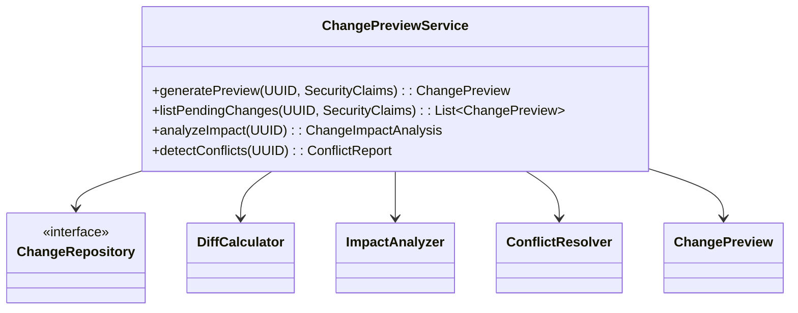
```mermaid
classDiagram
    class ChangePreviewService {
        +generatePreview(UUID, SecurityClaims): ChangePreview
        +listPendingChanges(UUID, SecurityClaims): List~ChangePreview~
        +analyzeImpact(UUID): ChangeImpactAnalysis
        +detectConflicts(UUID): ConflictReport
    }

    class ChangePreview
    class DiffCalculator
    class ImpactAnalyzer
    class ConflictResolver
    class ChangeRepository {
        <<interface>>
    }

    ChangePreviewService --> ChangeRepository
    ChangePreviewService --> DiffCalculator
    ChangePreviewService --> ImpactAnalyzer
    ChangePreviewService --> ConflictResolver
    ChangePreviewService --> ChangePreview
```

---

## Module 9: ChangeApplicationService

**Category:** Core Domain Service  
**Used By:** WF3  
**Stability Level:** STABLE

### Features

This module provides:
- **Atomic change application** (all-or-nothing transaction)
- **Batch change application** (apply multiple changes together)
- **Change validation** before application
- **Snapshot creation** before applying (for rollback)
- **Post-application verification** (board integrity check)
- **Audit logging** of all changes applied

This module does NOT provide:
- Rollback of applied changes (future enhancement)
- Conflict resolution (ConflictResolver handles it first)

### Internal Architecture

ChangeApplicationService is a transactional executor for approved changes. It validates each candidate change against live board state, applies mutations through repositories, verifies post-conditions, and writes audit entries.

**Architecture Diagram:**

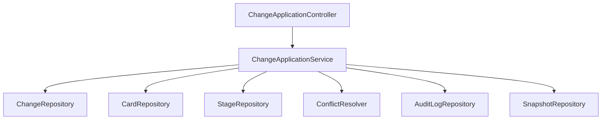
```mermaid
graph TB
    A[ChangeApplicationController] --> B[ChangeApplicationService]
    B --> C[ChangeRepository]
    B --> D[CardRepository]
    B --> E[StageRepository]
    B --> F[ConflictResolver]
    B --> G[AuditLogRepository]
    B --> H[SnapshotRepository]
```

### Design Justification

1. **Single transaction for batch apply:** avoids mixed state where only subset of approved changes is applied.
2. **Snapshot-before-write:** enables operational rollback support without reconstructing history from logs.
3. **Post-commit invariants:** validates board ordering and referential integrity after mutation set.

### Data Abstraction (MIT 6.005)

`AppliedChangeSet` abstracts an atomic mutation group over board entities.

**Rep Invariant:**
1. each change status is `APPROVED` before apply
2. each change status is `APPLIED` after apply
3. `appliedAt` is set iff status is `APPLIED`
4. snapshot exists for every applied change

### Stable Storage

```sql
CREATE TABLE change_snapshots (
    id UUID PRIMARY KEY DEFAULT gen_random_uuid(),
    change_id UUID NOT NULL,
    board_state JSONB NOT NULL,
    created_at TIMESTAMP NOT NULL DEFAULT CURRENT_TIMESTAMP,
    CONSTRAINT fk_snapshots_change FOREIGN KEY (change_id) REFERENCES changes(id),
    CONSTRAINT unique_snapshot_change UNIQUE (change_id)
);
```

### REST API Specification

#### POST /api/v1/changes/{id}/apply

Applies one approved change.

#### POST /api/v1/changes/apply-batch

Applies multiple approved changes atomically.

#### GET /api/v1/changes/{id}/verify

Returns post-application verification outcome.

### Class Declarations

```java
@Service
@Transactional
public class ChangeApplicationService {
    public void applyChange(UUID changeId, SecurityClaims claims)
        throws ChangeNotFoundException, AccessDeniedException, ChangeApplicationException;
    
    public void applyChanges(List<UUID> changeIds, SecurityClaims claims)
        throws ChangeApplicationException;
    
    private void validateChange(Change change) throws InvalidChangeException;
    private void applyCardMove(Change change) throws CardNotFoundException;
    private void applyCardUpdate(Change change) throws CardNotFoundException;
    private void applyCardCreation(Change change);
    private void verifyBoardIntegrity(UUID boardId) throws BoardIntegrityException;
}
```

```java
public class ChangeSnapshot {
    private final UUID id;
    private final UUID changeId;
    private final JsonNode boardState;
    private final LocalDateTime createdAt;
}

@Repository
public interface ChangeSnapshotRepository extends JpaRepository<ChangeSnapshot, UUID> {
    Optional<ChangeSnapshot> findByChangeId(UUID changeId);
}
```

### Class Hierarchy Diagram

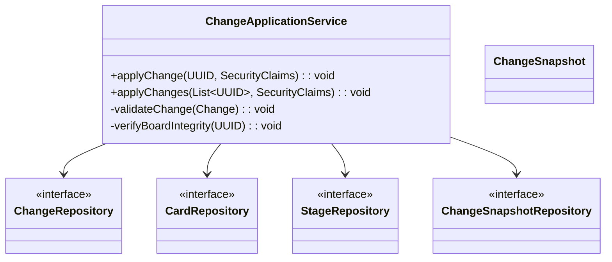
```mermaid
classDiagram
    class ChangeApplicationService {
        +applyChange(UUID, SecurityClaims): void
        +applyChanges(List~UUID~, SecurityClaims): void
        -validateChange(Change): void
        -verifyBoardIntegrity(UUID): void
    }

    class ChangeSnapshot
    class ChangeRepository {
        <<interface>>
    }
    class CardRepository {
        <<interface>>
    }
    class StageRepository {
        <<interface>>
    }
    class ChangeSnapshotRepository {
        <<interface>>
    }

    ChangeApplicationService --> ChangeRepository
    ChangeApplicationService --> CardRepository
    ChangeApplicationService --> StageRepository
    ChangeApplicationService --> ChangeSnapshotRepository
```

---

## Module 10: PromptBuilder

**Category:** Utility Service  
**Used By:** AIEngine  
**Stability Level:** STABLE

### Features

- Constructs optimized LLM prompts with examples, constraints, JSON schema
- Supports A/B testing different prompts
- Includes few-shot examples for better LLM output
- Constrains output format to JSON with specific schema
- Handles token counting for prompt size

This module does NOT provide:
- Direct LLM invocation (delegated to `LLMClient`)
- Domain object parsing (delegated to `ContentStructurer`)

### Internal Architecture

PromptBuilder composes prompts from reusable fragments: system directives, domain context, constraints, output schema, and few-shot examples. Templates are versioned to allow safe iterative prompt improvements.

**Architecture Diagram:**

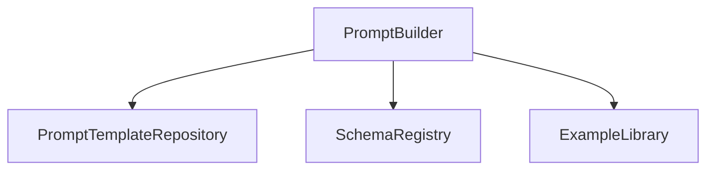
```mermaid
graph TB
    A[PromptBuilder] --> B[PromptTemplateRepository]
    A --> C[SchemaRegistry]
    A --> D[ExampleLibrary]
```

### Design Justification

1. **Template versioning:** supports reproducibility and safe rollback when prompt changes regress output quality.
2. **Schema-first prompting:** increases parse success and reduces malformed outputs.
3. **Few-shot isolation:** examples can be updated independently from control instructions.

### Data Abstraction (MIT 6.005)

`PromptDefinition` abstracts prompt construction input into a deterministic string output.

**Rep Invariant:**
1. `templateId` exists
2. `schemaName` exists and resolves
3. output prompt length is below configured max tokens

### Stable Storage

Prompt templates and schema snippets are persisted to avoid runtime drift across deployments.

```sql
CREATE TABLE prompt_templates (
    id UUID PRIMARY KEY DEFAULT gen_random_uuid(),
    name VARCHAR(100) NOT NULL,
    version INT NOT NULL,
    system_prompt TEXT NOT NULL,
    user_prompt_template TEXT NOT NULL,
    schema_name VARCHAR(100) NOT NULL,
    created_at TIMESTAMP NOT NULL DEFAULT CURRENT_TIMESTAMP,
    CONSTRAINT unique_prompt_template UNIQUE (name, version)
);
```

### REST API Specification

No external public REST API. Internal callers use Spring dependency injection.

Optional internal observability endpoint:
- `GET /api/v1/internal/prompts/{name}/latest`

### Class Declarations

```java
@Component
public class PromptBuilder {
    public String buildProjectAnalysisPrompt(String projectDescription);
    public String buildSummaryAnalysisPrompt(String summaryText, BoardContext context);
    public String buildChangeExtractionPrompt(String summaryText);
    
    private String getJsonSchema(String schemaType);
    private String getFewShotExamples(String exampleType);
    private String buildSystemMessage();
    private int estimateTokenCount(String prompt);
}
```

```java
@Repository
public interface PromptTemplateRepository extends JpaRepository<PromptTemplate, UUID> {
    Optional<PromptTemplate> findTopByNameOrderByVersionDesc(String name);
}
```

### Class Hierarchy Diagram

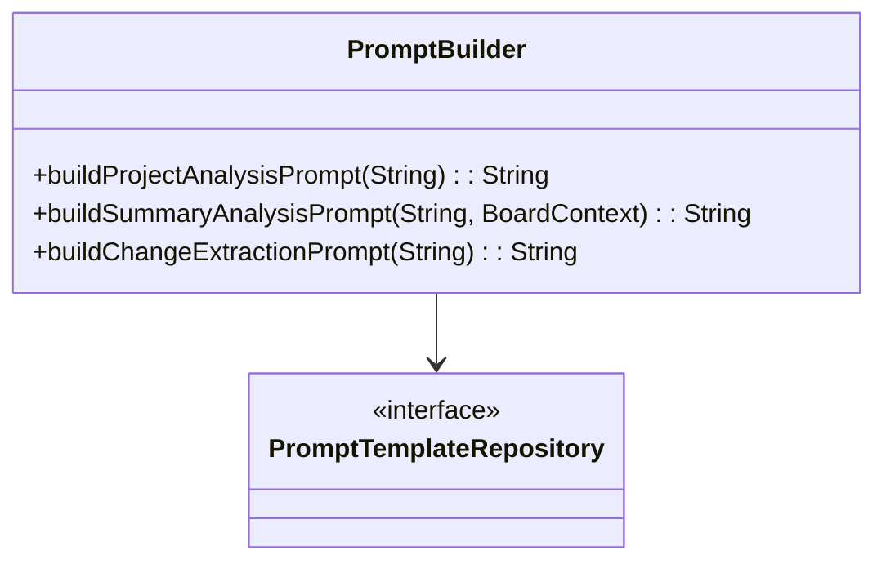
```mermaid
classDiagram
    class PromptBuilder {
        +buildProjectAnalysisPrompt(String): String
        +buildSummaryAnalysisPrompt(String, BoardContext): String
        +buildChangeExtractionPrompt(String): String
    }

    class PromptTemplateRepository {
        <<interface>>
    }

    PromptBuilder --> PromptTemplateRepository
```

---

## Module 11: ContentStructurer

**Category:** Utility Service  
**Used By:** AIEngine  
**Stability Level:** STABLE

### Features

- Parses LLM JSON output into domain objects
- Validates parsed content against schema
- Handles malformed JSON gracefully
- Provides detailed error messages for validation failures
- Transforms raw LLM output to application domain model

This module does NOT provide:
- Prompt construction
- Remote API communication

### Internal Architecture

ContentStructurer parses response payloads into typed domain objects using strict schema validation. It separates parsing (`JsonNode` traversal) from business validation (domain constraints) to keep error handling explicit.

**Architecture Diagram:**

```mermaid
graph TB
    A[ContentStructurer] --> B[JsonParser]
    A --> C[SchemaValidator]
    A --> D[DomainFactory]
```

### Design Justification

1. **Schema validation before mapping:** avoids partial object creation from malformed payloads.
2. **Typed factory mapping:** centralizes conversion logic and reduces parser duplication across workflows.
3. **Detailed parse exceptions:** improves debugging and prompt iteration speed.

### Data Abstraction (MIT 6.005)

`ParsedAnalysis` abstracts structurally valid AI output into domain-safe values.

**Rep Invariant:**
1. all required schema fields are present
2. enum fields map to valid domain enums
3. list fields are non-null and bounded

### Stable Storage

No module-owned persistent state. Durable artifacts are persisted by caller services (`SummaryService`, `BoardGenerator`) into `summaries`, `changes`, `boards`, `cards`.

### REST API Specification

No public REST API; module is internal.

### Class Declarations

```java
@Component
public class ContentStructurer {
    public BoardTemplate parseProjectAnalysis(String jsonResponse)
        throws ContentParsingException;
    
    public SummaryAnalysis parseSummaryAnalysis(String jsonResponse)
        throws ContentParsingException;
    
    public List<Change> parseChanges(String jsonResponse, UUID meetingId)
        throws ContentParsingException;
    
    private void validateAgainstSchema(JsonNode json, String schemaName)
        throws SchemaValidationException;
    
    private Stage parseStage(JsonNode stageJson);
    private Card parseCard(JsonNode cardJson);
}
```

### Class Hierarchy Diagram

```mermaid
classDiagram
    class ContentStructurer {
        +parseProjectAnalysis(String): BoardTemplate
        +parseSummaryAnalysis(String): SummaryAnalysis
        +parseChanges(String, UUID): List~Change~
    }

    class SchemaValidationException
    class ContentParsingException

    ContentStructurer --> SchemaValidationException
    ContentStructurer --> ContentParsingException
```

---

## Module 12: DiffCalculator

**Category:** Utility Service  
**Used By:** ChangePreviewService, Change record storage  
**Stability Level:** STABLE

### Features

- Computes before/after diffs for changes
- Identifies specific field changes
- Highlights key differences for UI
- Supports nested object diffs
- Provides human-readable summaries

This module does NOT provide:
- Change persistence
- Approval decisions

### Internal Architecture

DiffCalculator normalizes input objects into canonical JSON trees and computes path-based differences (`added`, `removed`, `modified`). It exposes both machine-readable and UI-friendly summaries.

**Architecture Diagram:**

```mermaid
graph TB
    A[DiffCalculator] --> B[Canonicalizer]
    A --> C[JsonTreeComparator]
    A --> D[DiffSummaryFormatter]
```

### Design Justification

1. **Canonicalization first:** avoids noisy diffs caused by key ordering.
2. **Path-oriented diff format:** easy for UI highlighting and API clients.
3. **Deterministic output:** repeatable diffs for audit and regression tests.

### Data Abstraction (MIT 6.005)

`FieldDiff` abstracts object change as `{added, removed, modified}` path sets.

**Rep Invariant:**
1. a field path cannot exist in more than one bucket
2. `modified[path]` always has both old and new value

### Stable Storage

No persistent storage owned by module. Diff results may be cached by caller in Redis for repeated preview requests.

### REST API Specification

Exposed via ChangePreview API:
- `GET /api/v1/changes/{id}/diff`

### Class Declarations

```java
@Component
public class DiffCalculator {
    public FieldDiff computeDiff(Object beforeState, Object afterState);
    
    public String generateDiffSummary(Change change);
    
    public List<ChangeHighlight> getHighlights(FieldDiff diff);
    
    private boolean valuesEqual(Object v1, Object v2);
}
```

```java
public class FieldDiff {
    private final Map<String, Object> added;
    private final Map<String, Object> removed;
    private final Map<String, ValueChange> modified;

    public Map<String, Object> getAdded();
    public Map<String, Object> getRemoved();
    public Map<String, ValueChange> getModified();
}
```

### Class Hierarchy Diagram

```mermaid
classDiagram
    class DiffCalculator {
        +computeDiff(Object, Object): FieldDiff
        +generateDiffSummary(Change): String
        +getHighlights(FieldDiff): List~ChangeHighlight~
    }

    class FieldDiff
    class ChangeHighlight

    DiffCalculator --> FieldDiff
    DiffCalculator --> ChangeHighlight
```

---

## Module 13: ImpactAnalyzer

**Category:** Utility Service  
**Used By:** ChangePreviewService  
**Stability Level:** STABLE

### Features

- Analyzes which cards/stages are affected by a change
- Assesses risk level (low/medium/high)
- Estimates effort/complexity
- Identifies related changes
- Predicts cascading effects

This module does NOT provide:
- Approval workflow
- Change application

### Internal Architecture

ImpactAnalyzer reads board topology and change intent, then computes affected entities and risk metrics. It aggregates structural impact (cards/stages), process impact (owners/watchers), and operational risk (conflicts, complexity score).

**Architecture Diagram:**

```mermaid
graph TB
    A[ImpactAnalyzer] --> B[KanbanBoardGateway]
    A --> C[ChangeRepository]
    A --> D[RiskModel]
    A --> E[DependencyGraphBuilder]
```

### Design Justification

1. **Centralized risk model:** keeps risk scoring consistent across UI and automation.
2. **Dependency graph evaluation:** handles cascade effects for linked cards.
3. **Side-effect free analysis:** safe to run repeatedly during review.

### Data Abstraction (MIT 6.005)

`ImpactSummary` abstracts a change into scope, risk, and effort outputs.

**Rep Invariant:**
1. `riskLevel in {LOW, MEDIUM, HIGH, CRITICAL}`
2. `effortPoints >= 0`
3. `affectedCards` and `affectedStages` are deduplicated

### Stable Storage

Module is computation-only. Input state is stable in `changes`, `cards`, `stages`, and `project_members` tables. Optional cached results can be persisted in `change_impact_cache`.

```sql
CREATE TABLE change_impact_cache (
    change_id UUID PRIMARY KEY,
    impact_payload JSONB NOT NULL,
    generated_at TIMESTAMP NOT NULL DEFAULT CURRENT_TIMESTAMP,
    CONSTRAINT fk_impact_cache_change FOREIGN KEY (change_id) REFERENCES changes(id)
);
```

### REST API Specification

Exposed via preview endpoint:
- `GET /api/v1/changes/{id}/impact`

### Class Declarations

```java
@Component
public class ImpactAnalyzer {
    public ImpactSummary analyzeChange(Change change)
        throws BoardNotFoundException, CardNotFoundException;
    
    public RiskLevel assessRisk(Change change);
    
    public List<UUID> findRelatedCards(Change change);
    
    private int estimateEffort(Change change);
}
```

```java
public class ImpactSummary {
    private final List<UUID> affectedCards;
    private final List<UUID> affectedStages;
    private final RiskLevel riskLevel;
    private final int effortPoints;

    public List<UUID> getAffectedCards();
    public List<UUID> getAffectedStages();
    public RiskLevel getRiskLevel();
    public int getEffortPoints();
}

public enum RiskLevel { LOW, MEDIUM, HIGH, CRITICAL; }
```

### Class Hierarchy Diagram

```mermaid
classDiagram
    class ImpactAnalyzer {
        +analyzeChange(Change): ImpactSummary
        +assessRisk(Change): RiskLevel
        +findRelatedCards(Change): List~UUID~
    }

    class ImpactSummary
    class RiskLevel {
        <<enumeration>>
    }

    ImpactAnalyzer --> ImpactSummary
    ImpactSummary --> RiskLevel
```

---

## Module 14: ConflictResolver

**Category:** Utility Service  
**Used By:** ChangePreviewService, ChangeApplicationService  
**Stability Level:** STABLE

### Features

- Detects conflicts between changes
- Detects conflicts with current board state
- Suggests conflict resolutions
- Prevents invalid state transitions
- Validates board constraints before applying changes

This module does NOT provide:
- Persistence of approved change decisions
- User notifications

### Internal Architecture

ConflictResolver compares a candidate change set against live board state and other pending changes. It emits conflict descriptors with severity and candidate resolutions.

**Architecture Diagram:**

```mermaid
graph TB
    A[ConflictResolver] --> B[ChangeRepository]
    A --> C[KanbanBoardGateway]
    A --> D[ConstraintCatalog]
    A --> E[ResolutionHeuristics]
```

### Design Justification

1. **Constraint catalog:** makes conflict rules explicit and testable.
2. **Separation from application service:** keeps decisioning independent from mutation path.
3. **Resolution suggestions:** reduces reviewer fatigue and supports faster triage.

### Data Abstraction (MIT 6.005)

`ConflictReport` abstracts conflict detection output as classified conflicts + fixes.

**Rep Invariant:**
1. every conflict has non-empty `code`, `message`, and `severity`
2. `canApply == false` if any blocking conflict exists

### Stable Storage

No required storage for operation. Optional persistence for diagnostics:

```sql
CREATE TABLE conflict_reports (
    id UUID PRIMARY KEY DEFAULT gen_random_uuid(),
    change_id UUID NOT NULL,
    payload JSONB NOT NULL,
    generated_at TIMESTAMP NOT NULL DEFAULT CURRENT_TIMESTAMP,
    CONSTRAINT fk_conflict_change FOREIGN KEY (change_id) REFERENCES changes(id)
);
```

### REST API Specification

Exposed as part of preview details and internal troubleshooting endpoints:
- `GET /api/v1/changes/{id}` includes `conflicts`
- `GET /api/v1/internal/changes/{id}/conflicts`

### Class Declarations

```java
@Component
public class ConflictResolver {
    public ConflictReport detectConflicts(Change change, Board board)
        throws BoardNotFoundException, CardNotFoundException;
    
    public boolean canApplyChange(Change change, Board board);
    
    public List<ConflictResolution> suggestResolutions(Conflict conflict);
}
```

```java
public class ConflictReport {
    private final UUID changeId;
    private final boolean canApply;
    private final List<Conflict> conflicts;
}

public class Conflict {
    private final String code;
    private final String message;
    private final ConflictSeverity severity;
}

public enum ConflictSeverity { INFO, WARNING, BLOCKING; }
```

### Class Hierarchy Diagram

```mermaid
classDiagram
    class ConflictResolver {
        +detectConflicts(Change, Board): ConflictReport
        +canApplyChange(Change, Board): boolean
        +suggestResolutions(Conflict): List~ConflictResolution~
    }

    class ConflictReport
    class Conflict
    class ConflictSeverity {
        <<enumeration>>
    }

    ConflictResolver --> ConflictReport
    ConflictReport --> Conflict
    Conflict --> ConflictSeverity
```

---

## Module 15: LLMClient

**Category:** Adapter Service  
**Used By:** AIEngine  
**Stability Level:** STABLE

### Features

- Calls OpenAI GPT-4 API
- Calls Anthropic Claude API  
- Handles rate limiting and backoff
- Implements circuit breaker pattern
- Manages API authentication
- Tracks LLM usage (tokens, costs)

This module does NOT provide:
- Prompt engineering logic
- Domain object interpretation

### Internal Architecture

LLMClient encapsulates provider-specific adapters behind a uniform call contract and resilience policies (timeout, retries, circuit breaker). Requests are tagged with trace IDs for observability and cost attribution.

**Architecture Diagram:**

```mermaid
graph TB
    A[AIEngine] --> B[LLMClient]
    B --> C[OpenAIAdapter]
    B --> D[AnthropicAdapter]
    B --> E[RetryPolicy]
    B --> F[CircuitBreaker]
    B --> G[UsageLogRepository]
```

### Design Justification

1. **Adapter split by provider:** isolates API differences and eases provider swap.
2. **Built-in fallback contract:** improves availability for user-facing flows.
3. **Persistent usage logging:** supports cost governance and anomaly detection.

### Data Abstraction (MIT 6.005)

`LLMResponse` abstracts provider output into normalized content + usage metrics.

**Rep Invariant:**
1. `content != null`
2. `provider in {openai, anthropic}`
3. `inputTokens >= 0 && outputTokens >= 0`
4. `durationMs >= 0`

### Stable Storage

```sql
CREATE TABLE llm_usage_logs (
    id UUID PRIMARY KEY DEFAULT gen_random_uuid(),
    provider VARCHAR(50) NOT NULL,
    operation VARCHAR(100) NOT NULL,
    request_hash VARCHAR(128) NOT NULL,
    input_tokens INT NOT NULL,
    output_tokens INT NOT NULL,
    duration_ms BIGINT NOT NULL,
    success BOOLEAN NOT NULL,
    created_at TIMESTAMP NOT NULL DEFAULT CURRENT_TIMESTAMP
);

CREATE INDEX idx_llm_usage_provider_time ON llm_usage_logs(provider, created_at DESC);
```

### REST API Specification

No direct external REST API.

Internal-only diagnostics:
- `GET /api/v1/internal/llm/usage?from=...&to=...`
- `GET /api/v1/internal/llm/health`

### Class Declarations

```java
@Component
public class LLMClient {
    public LLMResponse callOpenAI(String prompt) throws LLMException;
    
    public LLMResponse callAnthropic(String prompt) throws LLMException;
    
    private void handleRateLimit(LLMException error);
    private void handleTimeout(LLMException error);
    private String parseJsonContent(LLMResponse response);
}
```

```java
public class LLMResponse {
    private final String content;
    private final int inputTokens;
    private final int outputTokens;
    private final String provider;
    private final long durationMs;

    public String getContent();
    public int getInputTokens();
    public int getOutputTokens();
    public String getProvider();
    public long getDurationMs();
}

@Repository
public interface LLMUsageLogRepository extends JpaRepository<LLMUsageLog, UUID> {
    List<LLMUsageLog> findByProviderAndCreatedAtBetween(String provider, LocalDateTime from, LocalDateTime to);
}
```

### Class Hierarchy Diagram

```mermaid
classDiagram
    class LLMClient {
        +callOpenAI(String): LLMResponse
        +callAnthropic(String): LLMResponse
    }

    class OpenAIAdapter
    class AnthropicAdapter
    class LLMResponse
    class LLMUsageLogRepository {
        <<interface>>
    }

    LLMClient --> OpenAIAdapter
    LLMClient --> AnthropicAdapter
    LLMClient --> LLMUsageLogRepository
    LLMClient --> LLMResponse
```

### Configuration

- OpenAI API key stored in AWS Secrets Manager
- Anthropic API key stored in AWS Secrets Manager
- Timeout: 30 seconds per call
- Max retries: 3
- Backoff strategy: exponential (1s, 2s, 4s)

---

## Module 16: KanbanBoardGateway

**Category:** Adapter Service  
**Used By:** Various domain services  
**Stability Level:** STABLE

### Features

- Loads board state (stages, cards) for read-only operations
- Validates board structure and constraints
- Ensures referential integrity between cards/stages
- Provides optimized queries for common board operations

This module does NOT provide:
- Board mutation business rules (owned by board/change services)
- Approval policies

### Internal Architecture

KanbanBoardGateway is an anti-corruption layer over board persistence. It centralizes canonical board loads, consistency checks, and cross-table lookup helpers consumed by WF2/WF3 services.

**Architecture Diagram:**

```mermaid
graph TB
    A[KanbanBoardGateway] --> B[BoardRepository]
    A --> C[StageRepository]
    A --> D[CardRepository]
    A --> E[BoardConstraintValidator]
```

### Design Justification

1. **Single board-read abstraction:** avoids duplicate query composition in multiple services.
2. **Constraint checks at gateway edge:** catches data drift early.
3. **Gateway boundary:** supports future move to separate board service with minimal caller change.

### Data Abstraction (MIT 6.005)

`BoardSnapshot` abstracts relational board state into an immutable aggregate view.

**Rep Invariant:**
1. every stage references the same board
2. every card references an existing stage
3. stage positions are unique per board

### Stable Storage

Reads durable state from `boards`, `stages`, and `cards`; no module-owned write storage.

### REST API Specification

No public REST API. Internal callers use service injection.

Internal-only endpoint (optional):
- `GET /api/v1/internal/boards/{id}/snapshot`

### Class Declarations

```java
@Component
public class KanbanBoardGateway {
    public Board loadBoard(UUID boardId) throws BoardNotFoundException;
    
    public List<Card> loadCardsByStage(UUID stageId) throws StageNotFoundException;
    
    public void validateBoardStructure(Board board) throws BoardIntegrityException;
    
    public boolean stageExists(UUID boardId, UUID stageId);
    public boolean cardExists(UUID cardId);
}
```

```java
public class BoardSnapshot {
    private final Board board;
    private final List<Stage> stages;
    private final List<Card> cards;

    public Board getBoard();
    public List<Stage> getStages();
    public List<Card> getCards();
}
```

### Class Hierarchy Diagram

```mermaid
classDiagram
    class KanbanBoardGateway {
        +loadBoard(UUID): Board
        +loadCardsByStage(UUID): List~Card~
        +validateBoardStructure(Board): void
        +stageExists(UUID, UUID): boolean
        +cardExists(UUID): boolean
    }

    class BoardRepository {
        <<interface>>
    }
    class StageRepository {
        <<interface>>
    }
    class CardRepository {
        <<interface>>
    }

    KanbanBoardGateway --> BoardRepository
    KanbanBoardGateway --> StageRepository
    KanbanBoardGateway --> CardRepository
```

---

## Module 17: MeetingGateway

**Category:** Adapter Service  
**Used By:** SummaryService  
**Stability Level:** STABLE

### Features

- Loads meeting context (participants, project info)
- Validates meeting state
- Retrieves meeting notes/transcription
- Provides participant list for approval workflows

This module does NOT provide:
- Meeting lifecycle mutations
- Summary generation

### Internal Architecture

MeetingGateway encapsulates meeting read-model lookups and validation rules required by WF2 and WF3 services. It shields callers from meeting schema shape and participant join logic.

**Architecture Diagram:**

```mermaid
graph TB
    A[MeetingGateway] --> B[MeetingSessionRepository]
    A --> C[MeetingParticipantRepository]
    A --> D[MeetingNoteRepository]
    A --> E[MeetingStateValidator]
```

### Design Justification

1. **Gateway extraction:** prevents repeated join/query logic in SummaryService and ApprovalService.
2. **Uniform state validation:** ensures consistent behavior across all callers.
3. **Schema isolation:** allows meeting persistence refactors without breaking downstream services.

### Data Abstraction (MIT 6.005)

`MeetingContext` abstracts all meeting facts needed by consumers (`participants`, `notes`, `status`, `projectId`).

**Rep Invariant:**
1. `meetingId != null`
2. `projectId != null`
3. `participants` is non-null
4. if status is `COMPLETED`, notes may be non-empty and immutable

### Stable Storage

Reads durable records from `meeting_sessions`, `meeting_participants`, and `meeting_notes`.

```sql
CREATE TABLE meeting_notes (
    id UUID PRIMARY KEY DEFAULT gen_random_uuid(),
    meeting_id UUID NOT NULL,
    note_text TEXT NOT NULL,
    note_type VARCHAR(50) NOT NULL DEFAULT 'SUMMARY',
    created_at TIMESTAMP NOT NULL DEFAULT CURRENT_TIMESTAMP,
    CONSTRAINT fk_notes_meeting FOREIGN KEY (meeting_id) REFERENCES meeting_sessions(id)
);
```

### REST API Specification

No public REST API. Internal callers use dependency injection.

Internal-only endpoint (optional):
- `GET /api/v1/internal/meetings/{id}/context`

### Class Declarations

```java
@Component
public class MeetingGateway {
    public Meeting loadMeeting(UUID meetingId) throws MeetingNotFoundException;
    
    public List<User> getMeetingParticipants(UUID meetingId) throws MeetingNotFoundException;
    
    public String getMeetingNotes(UUID meetingId) throws MeetingNotFoundException;
    
    public void validateMeetingState(UUID meetingId) throws InvalidMeetingStateException;
}
```

```java
public class MeetingContext {
    private final UUID meetingId;
    private final UUID projectId;
    private final List<UUID> participants;
    private final String notes;
    private final MeetingStatus status;

    public UUID getMeetingId();
    public UUID getProjectId();
    public List<UUID> getParticipants();
    public String getNotes();
    public MeetingStatus getStatus();
}

@Repository
public interface MeetingNoteRepository extends JpaRepository<MeetingNote, UUID> {
    List<MeetingNote> findByMeetingId(UUID meetingId);
}
```

### Class Hierarchy Diagram

```mermaid
classDiagram
    class MeetingGateway {
        +loadMeeting(UUID): Meeting
        +getMeetingParticipants(UUID): List~User~
        +getMeetingNotes(UUID): String
        +validateMeetingState(UUID): void
    }

    class MeetingSessionRepository {
        <<interface>>
    }
    class MeetingParticipantRepository {
        <<interface>>
    }
    class MeetingNoteRepository {
        <<interface>>
    }

    MeetingGateway --> MeetingSessionRepository
    MeetingGateway --> MeetingParticipantRepository
    MeetingGateway --> MeetingNoteRepository
```

---

## Tier 3: Repository Layer

The repository layer provides data access for all domain objects. All repositories follow Spring Data JPA conventions and use parameterized queries to prevent SQL injection.

### UserRepository

```java
@Repository
public interface UserRepository extends JpaRepository<User, UUID> {
    Optional<User> findByEmail(String email);
    Optional<User> findByUsername(String username);
    List<User> findByRole(Role role);
}
```

### ProjectRepository

```java
@Repository
public interface ProjectRepository extends JpaRepository<Project, UUID> {
    List<Project> findByOwnerId(UUID ownerId);
    List<Project> findByStatus(ProjectStatus status);
    List<Project> findByOwnerIdAndStatus(UUID ownerId, ProjectStatus status);
}
```

### ProjectMemberRepository

```java
@Repository
public interface ProjectMemberRepository extends JpaRepository<ProjectMember, UUID> {
    List<ProjectMember> findByProjectId(UUID projectId);
    List<ProjectMember> findByUserId(UUID userId);
    Optional<ProjectMember> findByProjectIdAndUserId(UUID projectId, UUID userId);
}
```

### BoardRepository

```java
@Repository
public interface BoardRepository extends JpaRepository<Board, UUID> {
    List<Board> findByProjectId(UUID projectId);
    @Query("SELECT b FROM Board b WHERE b.projectId = ?1 ORDER BY b.createdAt DESC")
    List<Board> findRecentBoardsByProject(UUID projectId, Pageable pageable);
}
```

### StageRepository

```java
@Repository
public interface StageRepository extends JpaRepository<Stage, UUID> {
    List<Stage> findByBoardIdOrderByPosition(UUID boardId);
    Optional<Stage> findByBoardIdAndPosition(UUID boardId, int position);
}
```

### CardRepository

```java
@Repository
public interface CardRepository extends JpaRepository<Card, UUID> {
    List<Card> findByBoardId(UUID boardId);
    List<Card> findByStageIdOrderByPosition(UUID stageId);
    List<Card> findByBoardIdAndStageId(UUID boardId, UUID stageId);
    @Query("SELECT c FROM Card c WHERE c.stageId = ?1 ORDER BY c.position ASC")
    List<Card> findCardsInStageOrderedByPosition(UUID stageId);
}
```

### MeetingSessionRepository

```java
@Repository
public interface MeetingSessionRepository extends JpaRepository<Meeting, UUID> {
    List<Meeting> findByProjectId(UUID projectId);
    List<Meeting> findByCreatedBy(UUID createdBy);
    List<Meeting> findByStatus(MeetingStatus status);
}
```

### MeetingParticipantRepository

```java
@Repository
public interface MeetingParticipantRepository extends JpaRepository<MeetingParticipant, UUID> {
    List<MeetingParticipant> findByMeetingId(UUID meetingId);
    List<MeetingParticipant> findByUserId(UUID userId);
    Optional<MeetingParticipant> findByMeetingIdAndUserId(UUID meetingId, UUID userId);
}
```

### MeetingNoteRepository

```java
@Repository
public interface MeetingNoteRepository extends JpaRepository<MeetingNote, UUID> {
    List<MeetingNote> findByMeetingId(UUID meetingId);
}
```

### SummaryRepository

```java
@Repository
public interface SummaryRepository extends JpaRepository<Summary, UUID> {
    List<Summary> findByMeetingId(UUID meetingId);
    List<Summary> findByStatus(SummaryStatus status);
}
```

### ChangeRepository

```java
@Repository
public interface ChangeRepository extends JpaRepository<Change, UUID> {
    List<Change> findByMeetingId(UUID meetingId);
    List<Change> findByStatus(ChangeStatus status);
    List<Change> findByStatusOrderByCreatedAt(ChangeStatus status, Pageable pageable);
    @Query("SELECT c FROM Change c WHERE c.status = 'PENDING' OR c.status = 'READY_FOR_WF3'")
    List<Change> findPendingChanges();
}
```

### ApprovalRequestRepository

```java
@Repository
public interface ApprovalRequestRepository extends JpaRepository<ApprovalRequest, UUID> {
    List<ApprovalRequest> findByStatus(ApprovalStatus status);
    Optional<ApprovalRequest> findByEntityTypeAndEntityId(String entityType, UUID entityId);
    List<ApprovalRequest> findByDeadlineBeforeAndStatus(LocalDateTime deadline, ApprovalStatus status);
}
```

### ApprovalVoteRepository

```java
@Repository
public interface ApprovalVoteRepository extends JpaRepository<ApprovalVote, UUID> {
    List<ApprovalVote> findByApprovalRequestId(UUID requestId);
    Optional<ApprovalVote> findByApprovalRequestIdAndVoterId(UUID requestId, UUID voterId);
}
```

### ChangeReviewNoteRepository

```java
@Repository
public interface ChangeReviewNoteRepository extends JpaRepository<ChangeReviewNote, UUID> {
    List<ChangeReviewNote> findByChangeId(UUID changeId);
}
```

### ChangeSnapshotRepository

```java
@Repository
public interface ChangeSnapshotRepository extends JpaRepository<ChangeSnapshot, UUID> {
    Optional<ChangeSnapshot> findByChangeId(UUID changeId);
}
```

### PromptTemplateRepository

```java
@Repository
public interface PromptTemplateRepository extends JpaRepository<PromptTemplate, UUID> {
    Optional<PromptTemplate> findTopByNameOrderByVersionDesc(String name);
}
```

### LLMUsageLogRepository

```java
@Repository
public interface LLMUsageLogRepository extends JpaRepository<LLMUsageLog, UUID> {
    List<LLMUsageLog> findByProviderAndCreatedAtBetween(String provider, LocalDateTime from, LocalDateTime to);
}
```

### AuditLogRepository

```java
@Repository
public interface AuditLogRepository extends JpaRepository<AuditLog, UUID> {
    List<AuditLog> findByEntityTypeAndEntityId(String entityType, UUID entityId);
    List<AuditLog> findByActorId(UUID actorId);
    @Query("SELECT a FROM AuditLog a WHERE a.createdAt >= ?1 AND a.createdAt <= ?2 ORDER BY a.createdAt DESC")
    List<AuditLog> findAuditTrail(LocalDateTime from, LocalDateTime to);
}
```

---

## Database Schemas

### Complete PostgreSQL Schema

```sql
-- ============ Core Authentication ============

CREATE TABLE users (
    id UUID PRIMARY KEY DEFAULT gen_random_uuid(),
    email VARCHAR(255) NOT NULL UNIQUE,
    password_hash VARCHAR(255) NOT NULL,
    username VARCHAR(100) NOT NULL,
    role VARCHAR(50) NOT NULL DEFAULT 'MEMBER',
    created_at TIMESTAMP NOT NULL DEFAULT CURRENT_TIMESTAMP,
    updated_at TIMESTAMP NOT NULL DEFAULT CURRENT_TIMESTAMP,
    CONSTRAINT valid_email CHECK (email ~ '^[^@]+@[^@]+\.[^@]+$'),
    CONSTRAINT valid_role CHECK (role IN ('ADMIN', 'MANAGER', 'MEMBER', 'VIEWER')),
    CONSTRAINT non_empty_password CHECK (length(password_hash) > 0)
);

CREATE INDEX idx_users_email ON users(email);
CREATE INDEX idx_users_role ON users(role);

CREATE TABLE login_attempts (
    id UUID PRIMARY KEY DEFAULT gen_random_uuid(),
    email VARCHAR(255) NOT NULL,
    success BOOLEAN NOT NULL,
    ip_address VARCHAR(45),
    attempted_at TIMESTAMP NOT NULL DEFAULT CURRENT_TIMESTAMP,
    CONSTRAINT fk_login_attempts_user FOREIGN KEY (email) REFERENCES users(email)
);

CREATE INDEX idx_login_attempts_email_time ON login_attempts(email, attempted_at DESC);

-- ============ Project Management ============

CREATE TABLE projects (
    id UUID PRIMARY KEY DEFAULT gen_random_uuid(),
    name VARCHAR(255) NOT NULL,
    description TEXT,
    owner_id UUID NOT NULL,
    status VARCHAR(50) NOT NULL DEFAULT 'ACTIVE',
    created_at TIMESTAMP NOT NULL DEFAULT CURRENT_TIMESTAMP,
    updated_at TIMESTAMP NOT NULL DEFAULT CURRENT_TIMESTAMP,
    deleted_at TIMESTAMP,
    CONSTRAINT fk_projects_owner FOREIGN KEY (owner_id) REFERENCES users(id),
    CONSTRAINT valid_status CHECK (status IN ('ACTIVE', 'ARCHIVED', 'DELETED')),
    CONSTRAINT non_empty_name CHECK (length(name) > 0)
);

CREATE INDEX idx_projects_owner ON projects(owner_id);
CREATE INDEX idx_projects_status ON projects(status);
CREATE INDEX idx_projects_deleted ON projects(deleted_at);

CREATE TABLE project_members (
    id UUID PRIMARY KEY DEFAULT gen_random_uuid(),
    project_id UUID NOT NULL,
    user_id UUID NOT NULL,
    joined_at TIMESTAMP NOT NULL DEFAULT CURRENT_TIMESTAMP,
    CONSTRAINT fk_project_members_project FOREIGN KEY (project_id) REFERENCES projects(id) ON DELETE CASCADE,
    CONSTRAINT fk_project_members_user FOREIGN KEY (user_id) REFERENCES users(id),
    CONSTRAINT unique_membership UNIQUE (project_id, user_id)
);

CREATE INDEX idx_project_members_user ON project_members(user_id);
CREATE INDEX idx_project_members_project ON project_members(project_id);

-- ============ Kanban Boards ============

CREATE TABLE boards (
    id UUID PRIMARY KEY DEFAULT gen_random_uuid(),
    project_id UUID NOT NULL,
    title VARCHAR(255) NOT NULL,
    description TEXT,
    created_at TIMESTAMP NOT NULL DEFAULT CURRENT_TIMESTAMP,
    updated_at TIMESTAMP NOT NULL DEFAULT CURRENT_TIMESTAMP,
    CONSTRAINT fk_boards_project FOREIGN KEY (project_id) REFERENCES projects(id),
    CONSTRAINT non_empty_title CHECK (length(title) > 0)
);

CREATE INDEX idx_boards_project ON boards(project_id);

CREATE TABLE stages (
    id UUID PRIMARY KEY DEFAULT gen_random_uuid(),
    board_id UUID NOT NULL,
    name VARCHAR(100) NOT NULL,
    position INT NOT NULL,
    description TEXT,
    created_at TIMESTAMP NOT NULL DEFAULT CURRENT_TIMESTAMP,
    CONSTRAINT fk_stages_board FOREIGN KEY (board_id) REFERENCES boards(id) ON DELETE CASCADE,
    CONSTRAINT valid_position CHECK (position >= 0),
    CONSTRAINT unique_stage_position UNIQUE (board_id, position),
    CONSTRAINT non_empty_name CHECK (length(name) > 0)
);

CREATE INDEX idx_stages_board ON stages(board_id);

CREATE TABLE cards (
    id UUID PRIMARY KEY DEFAULT gen_random_uuid(),
    board_id UUID NOT NULL,
    stage_id UUID NOT NULL,
    title VARCHAR(255) NOT NULL,
    description TEXT,
    position INT NOT NULL,
    created_at TIMESTAMP NOT NULL DEFAULT CURRENT_TIMESTAMP,
    updated_at TIMESTAMP NOT NULL DEFAULT CURRENT_TIMESTAMP,
    CONSTRAINT fk_cards_board FOREIGN KEY (board_id) REFERENCES boards(id) ON DELETE CASCADE,
    CONSTRAINT fk_cards_stage FOREIGN KEY (stage_id) REFERENCES stages(id),
    CONSTRAINT valid_position CHECK (position >= 0),
    CONSTRAINT non_empty_title CHECK (length(title) > 0)
);

CREATE INDEX idx_cards_board_stage ON cards(board_id, stage_id);
CREATE INDEX idx_cards_stage ON cards(stage_id);

-- ============ Meetings & Summaries ============

CREATE TABLE meeting_sessions (
    id UUID PRIMARY KEY DEFAULT gen_random_uuid(),
    project_id UUID NOT NULL,
    created_by UUID NOT NULL,
    status VARCHAR(50) NOT NULL DEFAULT 'IN_PROGRESS',
    notes TEXT,
    created_at TIMESTAMP NOT NULL DEFAULT CURRENT_TIMESTAMP,
    ended_at TIMESTAMP,
    CONSTRAINT fk_meetings_project FOREIGN KEY (project_id) REFERENCES projects(id),
    CONSTRAINT fk_meetings_creator FOREIGN KEY (created_by) REFERENCES users(id),
    CONSTRAINT valid_status CHECK (status IN ('IN_PROGRESS', 'COMPLETED', 'CANCELLED')),
    CONSTRAINT notes_required_if_completed CHECK (status != 'COMPLETED' OR notes IS NOT NULL)
);

CREATE INDEX idx_meetings_project ON meeting_sessions(project_id);
CREATE INDEX idx_meetings_creator ON meeting_sessions(created_by);
CREATE INDEX idx_meetings_status ON meeting_sessions(status);

CREATE TABLE meeting_participants (
    id UUID PRIMARY KEY DEFAULT gen_random_uuid(),
    meeting_id UUID NOT NULL,
    user_id UUID NOT NULL,
    joined_at TIMESTAMP NOT NULL DEFAULT CURRENT_TIMESTAMP,
    CONSTRAINT fk_meeting_participants_meeting FOREIGN KEY (meeting_id) REFERENCES meeting_sessions(id) ON DELETE CASCADE,
    CONSTRAINT fk_meeting_participants_user FOREIGN KEY (user_id) REFERENCES users(id),
    CONSTRAINT unique_participant UNIQUE (meeting_id, user_id)
);

CREATE INDEX idx_meeting_participants_user ON meeting_participants(user_id);
CREATE INDEX idx_meeting_participants_meeting ON meeting_participants(meeting_id);

-- ============ Changes & Approvals (WF3) ============

CREATE TABLE changes (
    id UUID PRIMARY KEY DEFAULT gen_random_uuid(),
    meeting_id UUID NOT NULL,
    change_type VARCHAR(50) NOT NULL,
    current_state JSONB NOT NULL,
    proposed_state JSONB NOT NULL,
    status VARCHAR(50) NOT NULL DEFAULT 'PENDING',
    created_at TIMESTAMP NOT NULL DEFAULT CURRENT_TIMESTAMP,
    applied_at TIMESTAMP,
    CONSTRAINT fk_changes_meeting FOREIGN KEY (meeting_id) REFERENCES meeting_sessions(id),
    CONSTRAINT valid_change_type CHECK (change_type IN ('MOVE_CARD', 'UPDATE_CARD', 'CREATE_CARD', 'DELETE_CARD')),
    CONSTRAINT valid_change_status CHECK (status IN ('PENDING', 'READY_FOR_WF3', 'APPROVED', 'REJECTED', 'APPLIED'))
);

CREATE INDEX idx_changes_meeting ON changes(meeting_id);
CREATE INDEX idx_changes_status ON changes(status);

CREATE TABLE change_review_notes (
    id UUID PRIMARY KEY DEFAULT gen_random_uuid(),
    change_id UUID NOT NULL,
    author_id UUID NOT NULL,
    note TEXT NOT NULL,
    created_at TIMESTAMP NOT NULL DEFAULT CURRENT_TIMESTAMP,
    CONSTRAINT fk_review_note_change FOREIGN KEY (change_id) REFERENCES changes(id),
    CONSTRAINT fk_review_note_author FOREIGN KEY (author_id) REFERENCES users(id)
);

CREATE INDEX idx_change_review_notes_change ON change_review_notes(change_id);

CREATE TABLE change_snapshots (
    id UUID PRIMARY KEY DEFAULT gen_random_uuid(),
    change_id UUID NOT NULL,
    board_state JSONB NOT NULL,
    created_at TIMESTAMP NOT NULL DEFAULT CURRENT_TIMESTAMP,
    CONSTRAINT fk_snapshots_change FOREIGN KEY (change_id) REFERENCES changes(id),
    CONSTRAINT unique_snapshot_change UNIQUE (change_id)
);

CREATE TABLE change_impact_cache (
    change_id UUID PRIMARY KEY,
    impact_payload JSONB NOT NULL,
    generated_at TIMESTAMP NOT NULL DEFAULT CURRENT_TIMESTAMP,
    CONSTRAINT fk_impact_cache_change FOREIGN KEY (change_id) REFERENCES changes(id)
);

CREATE TABLE conflict_reports (
    id UUID PRIMARY KEY DEFAULT gen_random_uuid(),
    change_id UUID NOT NULL,
    payload JSONB NOT NULL,
    generated_at TIMESTAMP NOT NULL DEFAULT CURRENT_TIMESTAMP,
    CONSTRAINT fk_conflict_change FOREIGN KEY (change_id) REFERENCES changes(id)
);

CREATE INDEX idx_conflict_reports_change ON conflict_reports(change_id);

CREATE TABLE approval_requests (
    id UUID PRIMARY KEY DEFAULT gen_random_uuid(),
    entity_type VARCHAR(100) NOT NULL,
    entity_id UUID NOT NULL,
    rule_type VARCHAR(50) NOT NULL,
    status VARCHAR(50) NOT NULL DEFAULT 'PENDING',
    required_approvers JSONB NOT NULL,
    created_at TIMESTAMP NOT NULL DEFAULT CURRENT_TIMESTAMP,
    deadline TIMESTAMP,
    CONSTRAINT valid_status CHECK (status IN ('PENDING', 'APPROVED', 'REJECTED', 'EXPIRED')),
    CONSTRAINT valid_rule CHECK (rule_type IN ('UNANIMOUS', 'QUORUM', 'CONSENSUS'))
);

CREATE INDEX idx_approval_requests_entity ON approval_requests(entity_type, entity_id);
CREATE INDEX idx_approval_requests_status ON approval_requests(status);

CREATE TABLE approval_votes (
    id UUID PRIMARY KEY DEFAULT gen_random_uuid(),
    approval_request_id UUID NOT NULL,
    voter_id UUID NOT NULL,
    decision VARCHAR(50) NOT NULL,
    feedback TEXT,
    voted_at TIMESTAMP NOT NULL DEFAULT CURRENT_TIMESTAMP,
    CONSTRAINT fk_approval_votes_request FOREIGN KEY (approval_request_id) REFERENCES approval_requests(id),
    CONSTRAINT fk_approval_votes_voter FOREIGN KEY (voter_id) REFERENCES users(id),
    CONSTRAINT valid_decision CHECK (decision IN ('APPROVE', 'REJECT')),
    CONSTRAINT unique_vote UNIQUE (approval_request_id, voter_id)
);

CREATE INDEX idx_approval_votes_request ON approval_votes(approval_request_id);
CREATE INDEX idx_approval_votes_voter ON approval_votes(voter_id);

-- ============ Prompting & AI Operations ============

CREATE TABLE prompt_templates (
    id UUID PRIMARY KEY DEFAULT gen_random_uuid(),
    name VARCHAR(100) NOT NULL,
    version INT NOT NULL,
    system_prompt TEXT NOT NULL,
    user_prompt_template TEXT NOT NULL,
    schema_name VARCHAR(100) NOT NULL,
    created_at TIMESTAMP NOT NULL DEFAULT CURRENT_TIMESTAMP,
    CONSTRAINT unique_prompt_template UNIQUE (name, version)
);

CREATE TABLE llm_usage_logs (
    id UUID PRIMARY KEY DEFAULT gen_random_uuid(),
    provider VARCHAR(50) NOT NULL,
    operation VARCHAR(100) NOT NULL,
    request_hash VARCHAR(128) NOT NULL,
    input_tokens INT NOT NULL,
    output_tokens INT NOT NULL,
    duration_ms BIGINT NOT NULL,
    success BOOLEAN NOT NULL,
    created_at TIMESTAMP NOT NULL DEFAULT CURRENT_TIMESTAMP
);

CREATE INDEX idx_llm_usage_provider_time ON llm_usage_logs(provider, created_at DESC);

-- ============ Audit Log ============

CREATE TABLE audit_log (
    id UUID PRIMARY KEY DEFAULT gen_random_uuid(),
    entity_type VARCHAR(100) NOT NULL,
    entity_id UUID NOT NULL,
    action VARCHAR(50) NOT NULL,
    actor_id UUID,
    details JSONB,
    created_at TIMESTAMP NOT NULL DEFAULT CURRENT_TIMESTAMP,
    CONSTRAINT fk_audit_actor FOREIGN KEY (actor_id) REFERENCES users(id)
);

CREATE INDEX idx_audit_entity ON audit_log(entity_type, entity_id);
CREATE INDEX idx_audit_actor ON audit_log(actor_id);
CREATE INDEX idx_audit_created ON audit_log(created_at DESC);

-- ============ Indices for Common Queries ============

-- Fast lookup for board content (WF1)
CREATE INDEX idx_cards_all_info ON cards(board_id, stage_id, position);

-- Fast lookup for pending changes (WF3)
CREATE INDEX idx_changes_pending_by_board ON changes(status) WHERE status IN ('PENDING', 'READY_FOR_WF3');

-- Fast lookup for active approvals (WF2, WF3)
CREATE INDEX idx_approvals_pending ON approval_requests(status) WHERE status = 'PENDING';

-- Fast lookup for meeting history (WF2)
CREATE INDEX idx_meetings_date_range ON meeting_sessions(project_id, created_at DESC);
```

---

## Module Dependencies & Load Order

**Dependency Graph:**

```
UserAuthenticationService (base)
├── ProjectService
│   ├── BoardGenerator
│   │   ├── AIEngine
│   │   ├── PromptBuilder
│   │   ├── ContentStructurer
│   │   └── LLMClient
│   ├── MeetingService
│   │   ├── SummaryService
│   │   │   ├── AIEngine
│   │   │   ├── ChangeRepository
│   │   │   └── ApprovalService
│   │   └── ApprovalService
│   │       ├── ApprovalRequestRepository
│   │       └── ApprovalVoteRepository
│   ├── ChangePreviewService
│   │   ├── DiffCalculator
│   │   ├── ImpactAnalyzer
│   │   ├── ConflictResolver
│   │   ├── ChangeRepository
│   │   └── KanbanBoardGateway
│   └── ChangeApplicationService
│       ├── ConflictResolver
│       ├── ChangeRepository
│       ├── CardRepository
│       └── AuditLogRepository
├── PromptBuilder (utilities)
├── ContentStructurer (utilities)
├── DiffCalculator (utilities)
├── ImpactAnalyzer (utilities)
├── ConflictResolver (utilities)
├── LLMClient (adapters)
├── KanbanBoardGateway (adapters)
└── MeetingGateway (adapters)
```

---

## API Response Format Standards

Note: Some module-level endpoint examples above are concise payload illustrations. Production responses SHOULD follow this envelope format for consistency.

All API responses follow this standard envelope:

### Success Response (2xx)

```json
{
  "status": "success",
  "data": { /* actual response */ },
  "timestamp": "2026-03-17T12:00:00Z"
}
```

### Error Response (4xx, 5xx)

```json
{
  "status": "error",
  "error": {
    "code": "RESOURCE_NOT_FOUND",
    "message": "Project with ID 550e8400 not found",
    "details": {
      "projectId": "550e8400-e29b-41d4-a716-446655440000"
    }
  },
  "timestamp": "2026-03-17T12:00:00Z"
}
```

### Pagination Format

```json
{
  "status": "success",
  "data": {
    "content": [ /* items */ ],
    "pagination": {
      "pageNumber": 0,
      "pageSize": 20,
      "totalElements": 125,
      "totalPages": 7,
      "hasNext": true,
      "hasPrevious": false
    }
  },
  "timestamp": "2026-03-17T12:00:00Z"
}
```

---

## Security Standards

### Authentication
- JWT tokens in Authorization header: `Bearer <token>`
- Token expiration: 24 hours
- Refresh endpoint: POST /api/v1/auth/refresh

### Authorization
- Role-based access control (RBAC) on all endpoints
- Resource-level authorization checks in service layer
- Audit logging of authorization decisions

### Data Protection
- Passwords hashed with bcrypt (cost factor 12)
- API keys in AWS Secrets Manager
- Database connections require SSL
- Sensitive fields not included in API responses

---

## Testing Strategy

### Unit Tests
- Each service class has >80% code coverage
- Mock all external dependencies (LLMClient, repositories)
- Test both happy path and error conditions

### Integration Tests
- Test service-to-repository interactions with TestContainers
- Spinning up real PostgreSQL container for database tests
- Test transaction rollback scenarios

### End-to-End Tests
- Full workflow tests (WF1, WF2, WF3)
- Test approval workflows with multiple voting scenarios
- Test change application with conflict detection

---

## Conclusion

This comprehensive specification provides the complete technical design for all backend modules of FlowBoard. Each module is designed with:

1. **Clear responsibility** - Single purpose, well-defined boundaries
2. **Encapsulation** - Internal details hidden, stable external API
3. **Testability** - Dependency injection, mockable dependencies
4. **Auditability** - Immutable logging, complete history
5. **Scalability** - Stateless services, efficient queries, indexed databases
6. **Maintainability** - Simple designs, consistent patterns, documented contracts

Backend developers can use this specification to:
- Understand module responsibilities and interactions
- Implement each module following the specified API
- Design tests covering all documented functionality
- Verify security and performance requirements
- Debug issues using the dependency graph and data flow diagrams

All modules are designed to scale horizontally (no shared state) and can be deployed independently once microservices separation occurs.

---

## ADT Compliance Guidelines

This section provides implementation guidance for maintaining Abstract Data Type (ADT) compliance per MIT 6.005 principles. All domain entities (User, Project, Change, etc.) must follow these patterns.

### Mandatory Pattern: checkRep() Method

Every aggregate root class MUST include a private checkRep() method:

```java
/**
 * Verifies that the rep invariant is satisfied.
 * Called after construction and after every mutation.
 * Helps catch bugs early and maintain data integrity.
 */
private void checkRep() {
    // Assertions should NEVER fail in production, but catch development bugs
    assert id != null : "Rep invariant violated: id is null";
    assert email != null && email.matches(EMAIL_REGEX) 
        : "Rep invariant violated: invalid email";
    // ... more assertions covering all invariant constraints
}

// Call checkRep() in:
// 1. Constructor (before object is published)
public User(...) {
    // ... field assignments
    checkRep();  // Last line before close brace
}

// 2. After mutations
public void updateEmail(String newEmail) {
    validateEmail(newEmail);
    this.email = newEmail;
    checkRep();  // Verify new state is still valid
}

// 3. Before returning mutable state (if any)
public Collection<SomeType> getSomething() {
    checkRep();
    return Collections.unmodifiableCollection(internalState);
}
```

### Defensive Copying Pattern

When returning mutable collection types, always use defensive copies:

```java
// DON'T: Returns mutable reference
public Set<UUID> getTeamMembers() {
    return this.teamMembers;  // WRONG - client can modify!
}

// DO: Return unmodifiable wrapper
public Set<UUID> getTeamMembers() {
    checkRep();  // Verify state
    return Collections.unmodifiableSet(this.teamMembers);  // Safe
}

// BETTER: Make internal copy first
public Set<UUID> getTeamMembers() {
    checkRep();
    return Collections.unmodifiableSet(new HashSet<>(this.teamMembers));
}

// In constructor:
public Project(Set<UUID> teamMembers) {
    // Defensive copy: don't trust caller's Set
    Set<UUID> copy = new HashSet<>(teamMembers);
    if (!copy.contains(ownerId)) {
        throw new IllegalArgumentException("Owner must be team member");
    }
    this.teamMembers = Collections.unmodifiableSet(copy);
    checkRep();  // Verify invariant
}
```

### Mutation Pattern: Immutable Updates

For aggregate roots, prefer creating new instances over mutating:

```java
// DON'T: Mutable update (allows caller to bypass invariants)
public void setTeamMembers(Set<UUID> members) {
    this.teamMembers = members;  // WRONG - no validation!
}

// DO: Create new Project with updated field
public Project withTeamMember(UUID userId) {
    // Verify preconditions
    if (this.teamMembers.contains(userId)) {
        throw new MemberAlreadyExistsException();
    }
    
    // Create new Set (with new member)
    Set<UUID> newTeam = new HashSet<>(this.teamMembers);
    newTeam.add(userId);
    
    // Create new Project (constructor calls checkRep())
    return new Project(
        this.id,
        this.name,
        this.description,
        this.ownerId,
        newTeam,
        this.status,
        this.createdAt,
        LocalDateTime.now(),  // updatedAt
        this.deletedAt
    );
}
```

### Representation Exposure Prevention

Never expose internal mutable types in API responses:

```java
// DON'T: DTO exposes mutable List
@Data
public class ProjectDTO {
    public List<UUID> teamMembers;  // WRONG - client can modify
}

// DO: DTO exposes immutable type
@Data  
public class ProjectDTO {
    @JsonProperty
    private final Set<UUID> teamMembers;  // Immutable
    
    @JsonCreator
    public ProjectDTO(Set<UUID> teamMembers) {
        this.teamMembers = Collections.unmodifiableSet(
            new HashSet<>(teamMembers)
        );
    }
}

// Or better: use List but serialize as unmodifiable
@Data
public class ProjectDTO {
    public final List<UUID> teamMembers;  // Immutable List
    
    public ProjectDTO(List<UUID> teamMembers) {
        this.teamMembers = Collections.unmodifiableList(
            new ArrayList<>(teamMembers)
        );
    }
}
```

### Transaction Boundary Enforcement

For state-changing operations, wrap in transactions:

```java
@Service
@Transactional  // Spring manages Transaction begin/commit/rollback
public class ProjectService {
    
    @Transactional
    public Project addTeamMember(UUID projectId, UUID userId, User requester) {
        // Transaction starts here (implicit)
        
        Project project = projectRepository.findById(projectId)
            .orElseThrow(() -> new ProjectNotFoundException());
        project.checkRep();  // Verify loaded state
        
        // Authorization check
        authorizeOwnershipOrAdmin(project, requester);
        
        // Create updated Project via immutable update
        Project updated = project.withTeamMember(userId);
        // Constructor calls checkRep() - invariants verified
        
        // Persist
        projectRepository.save(updated);
        auditLog.logMemberAdded(projectId, userId, requester.getId());
        
        // Transaction commits here (implicit on return)
        return updated;
    }
    
    // If error occurs, transaction auto-rolls back
    // Partially updated database state is never visible
}
```

### Change Entity Special Handling

The Change entity stores JSON state (current_state, proposed_state). Handle carefully:

```java
// DON'T: Raw JSON strings
public class Change {
    public String currentState;      // WRONG - unvalidated
    public String proposedState;     // WRONG - unvalidated
}

// DO: Typed Value Objects
public class Change {
    private final ChangeState currentState;      // Immutable  
    private final ChangeState proposedState;     // Immutable
    
    public Change(ChangeState current, ChangeState proposed) {
        this.currentState = Objects.requireNonNull(current).validate();
        this.proposedState = Objects.requireNonNull(proposed).validate();
        checkRep();
    }
    
    public ChangeState getCurrentState() {
        checkRep();
        return currentState;  // Immutable, safe to return
    }
}

// ChangeState Value Object with invariant checks
public class ChangeState {
    public static final int SCHEMA_VERSION = 1;
    
    private final int version;
    private final String changeType;  // MOVE, CREATE, UPDATE, DELETE
    private final String entityId;    // Card ID being changed
    
    public ChangeState(int version, String changeType, String entityId) {
        this.version = version;
        this.changeType = Objects.requireNonNull(changeType);
        this.entityId = Objects.requireNonNull(entityId);
        validate();  // Verify before construction completes
    }
    
    public ChangeState validate() {
        assert version == SCHEMA_VERSION 
            : "Unsupported schema version: " + version;
        assert changeType.matches("MOVE|CREATE|UPDATE|DELETE")
            : "Invalid changeType: " + changeType;
        assert !entityId.isBlank()
            : "entityId cannot be blank";
        // Invariants verified; safe to use
        return this;
    }
}
```

---

## Invariant Specifications

This section centralizes all domain invariants for reference and implementation.

### User Invariant

```
id ≠ null (UUID)
email ≠ null AND matches ^[^@]+@[^@]+\.[^@]+$
passwordHash ≠ null AND length ≥ 60 (bcrypt format)
username ≠ null AND 3 ≤ length ≤ 50
role ∈ {ADMIN, MANAGER, MEMBER, VIEWER}
createdAt ≤ LocalDateTime.now()
updatedAt ≥ createdAt

Enforced by:
- SQL: CONSTRAINT valid_email, CONSTRAINT valid_role, UNIQUE(email)
- Java: AuthService constructor validation, checkRep()
```

### Project Invariant

```
id ≠ null (UUID)
name ≠ null AND 1 ≤ length ≤ 255
description = null OR length ≤ 5000
ownerId ≠ null AND exists in users table
status ∈ {ACTIVE, ARCHIVED, DELETED}
teamMembers ≠ null AND non-empty
ownerId ∈ teamMembers (owner always member)
createdAt ≤ LocalDateTime.now()
updatedAt ≥ createdAt
If status = DELETED: deletedAt ≠ null AND deletedAt ≤ LocalDateTime.now()

Enforced by:
- SQL: CONSTRAINT fk_projects_owner, CONSTRAINT valid_status, CONSTRAINT non_empty_name
- Java: ProjectService constructor validation, checkRep()
- Critical mutation: removeTeamMember() must never remove owner or empty team
```

### Change Invariant

```
id ≠ null (UUID)
meetingId ≠ null AND exists in meetings table
changeType ∈ {MOVE_CARD, CREATE_CARD, UPDATE_CARD, DELETE_CARD}
currentState ≠ null AND valid ChangeState object
proposedState ≠ null AND valid ChangeState object
status ∈ {PENDING, READY_FOR_WF3, APPROVED, REJECTED, APPLIED}
createdAt ≤ LocalDateTime.now()
appliedAt = null OR (appliedAt ≥ createdAt AND status = APPLIED)

Enforced by:
- Java: Change constructor validation, checkRep()
- Mutation: Status transitions follow state machine rules
```

### ApprovalRequest Invariant

```
id ≠ null (UUID)
entityType ≠ null AND entityId ≠ null
entityId exists in referenced table implied by entityType
ruleType ∈ {UNANIMOUS, QUORUM, CONSENSUS}
status ∈ {PENDING, APPROVED, REJECTED, EXPIRED}
deadline ≥ createdAt
createdAt ≤ LocalDateTime.now()

Enforced by:
- SQL: CONSTRAINT valid_rule, CONSTRAINT valid_status
- Java: ApprovalService constructor validation, checkRep()
- Critical mutation: Cannot reopen closed approval requests
```

### ApprovalVote Invariant

```
id ≠ null (UUID)
requestId ≠ null AND exists in approval_requests table
approverId ≠ null AND exists in users table
decision ∈ {APPROVE, REJECT}
votedAt ≤ LocalDateTime.now()
Uniqueness: No duplicate (requestId, approverId) pairs

Enforced by:
- SQL: CONSTRAINT fk_approval_votes_request, UNIQUE(approval_request_id, voter_id)
- Java: ApprovalService constructor validation, checkRep()
- Critical constraint: Cannot vote after deadline (checked in service)
```

---

*This specification was updated for MIT 6.005 ADT compliance on March 17, 2026.*
*All future module additions must include checkRep() patterns per Mandatory Pattern section.*
